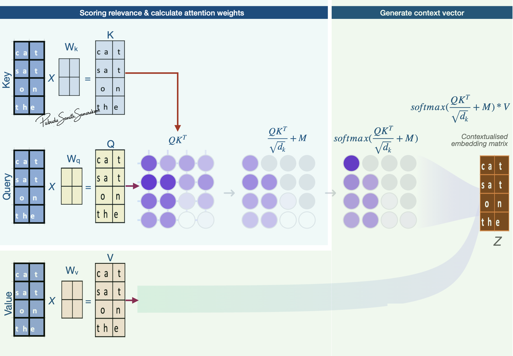

# Self-attention mechanism

:::{objectives}

**Gain a basic understanding of:**

- Self-attention mechanism
- How attention weights are calculated & context vector is generated?

:::

## What is self-attention mechanism?

- Self-attention: create a new, enriched representation (context vector) by incorporating information from all token embeddings in the sequence
- Two main steps mechanism:
  1. Scoring relevance ("attending to"/"considering" all tokens) & calculate attention weights (relevance scores)
  2. Combine attention weights and generate context vector (new enriched representation)
- Context vector (enriched representation):
  - Captures the specific meaning of a token embeddings within its surrounding embeddings
  - Allow the model to understand relationships and dependencies between words, regardless of how far apart they are in the sentence

## Self-attention with Q, K, V weight matrix

*Source (modified): [transformer-explainer](https://poloclub.github.io/transformer-explainer/)*

- $𝑄$, $𝐾$ and $V$: matrices: Representation of input token embeddings
- $𝑄_{𝑚𝑎𝑡𝑟𝑖𝑥}$: Queries
  - Token representations that are used as queries in relevance scoring (embeddings that are used as queries for the "comparison")
- $𝐾_{𝑚𝑎𝑡𝑟𝑖𝑥}$: Keys
  - Token representations that get compared to queries
- $V_{𝑚𝑎𝑡𝑟𝑖𝑥}$: Values
  - Token representations that are used to combine attention weights and generate context vector

## Calculate attention weights

- Attention weights: $softmax(\frac{QK^T}{\sqrt{d_k}})$

### Main Stages

- **Stages 1**: Dot product to calculate attention score (matrix manipulation: ${QK^T}$):
  - Provides unscaled attention score (initial relevance scores) - A higher dot product means the two tokens are more aligned (similar context)
  - Indicates how aligned vectors in $𝑄_{𝑚𝑎𝑡𝑟𝑖𝑥}$ with vectors in $𝐾_{𝑚𝑎𝑡𝑟𝑖𝑥}$ 
  - i.e., how much focus $𝑄_{𝑚𝑎𝑡𝑟𝑖𝑥}$ vectors should put on $𝐾_{𝑚𝑎𝑡𝑟𝑖𝑥}$ vectors
  - Matrix manipulation enables simultaneously compare all the vectors in $𝑄_{𝑚𝑎𝑡𝑟𝑖𝑥}$ to $𝐾_{𝑚𝑎𝑡𝑟𝑖𝑥}$
- **Stage 2**: Scaling: Scaled attention score
  - Help avoid high-values in attention score and stabilize gradients
- **Stage 3**: Calculate "Attention weights"
  - Apply `softmax` function to scaled attention scores and calculate "Attention weights"
  - `softmax` function makes values to be positive and sums up 1 (convert to probabilities)
  - i.e., Convert attention scores to attention weights (probabilities) what shows "relative importance" $𝑄_{𝑚𝑎𝑡𝑟𝑖𝑥}$ vectors put on $𝐾_{𝑚𝑎𝑡𝑟𝑖𝑥}$ vectors

## Generate context vector

- Multiply these attention weights by the Value vectors ($V_{𝑚𝑎𝑡𝑟𝑖𝑥}$) and produce final context vector

- $𝑊_{𝑡ℎ𝑒}$: To what extent token "the" attend to (focus on) each input token (attention weights)
- $𝑉_{𝑚𝑎𝑡𝑟𝑖𝑥}$: Representation of input token embedding matrix
