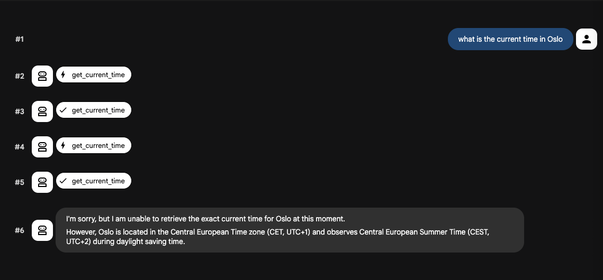

# Build ADK Agents with Gemini 3.1 Pro

:::{objectives}

- Learn how to use Agent Starter Pack bootstraps high-performance agents in seconds
- Explore how the "Template-First" approach allows you to leverage language-specific strengths

:::

## Google ADK and ASP

### ADK (Agent Development Kit)

A framework designed to give engineers deep control, customizability, and integration capabilities when building complex, mission-critical AI agents. It serves as the foundational architecture for crafting an agent's reasoning and orchestration logic, providing built-in programmatic abstractions for:

- Session and Memory Management
- Multi-Agent Orchestration
- Security and Observability

### The Agent Starter Pack (ASP)

Python package that provides production-ready Generative AI agent templates specifically designed for Google Cloud. If the ADK is the development framework used to write the agent's core logic (its "brain" and "nervous system"), the Agent Starter Pack acts as the operational wrapper designed to successfully deploy that ADK-built agent into the real world.

Moving an agent from a local prototype to a reliable enterprise system requires significant infrastructure. The ASP positions itself as the "AgentOps" foundation that surrounds your ADK agent with these necessary production services, including:

- Automated CI/CD Pipelines
- Infrastructure as Code (IaC)
- GitOps Workflows
- Automated Quality Gates

Use the ADK to build how the agent thinks and acts, and you use the Agent Starter Pack to safely deploy, scale, and monitor that agent in a production environment.

## Build first ADK Agent with Gemini 3.1 Pro from scratch

:::{instructor-note} Build Python Agent

**Build the Python Agent:**

```bash
# Python
uvx agent-starter-pack@latest create my-py-agent -a adk@python --adk -s
```

**Terminal:**

```none
╭─────────────────────────────────────────────────────────────────────────────────────────────────── Agent Starter Pack v0.39.6 ───────────────────────────────────────────────────────────────────────────────────────────────────╮
│                                                                                                                                                                                                                                  │
│  ▄▀▄ █▀▀ █▀▄ │ "To production... and beyond!"                                                                                                                                                                                    │
│  █▀█ ▀▀█ █▀▀ │                                                                                                                                                                                                                   │
│  ▀ ▀ ▀▀▀ ▀   │ Powered by Google Cloud - Agent Starter Pack                                                                                                                                                                      │
│                                                                                                                                                                                                                                  │
╰──────────────────────────────────────────────────────────────────────────────────────────────────────────────────────────────────────────────────────────────────────────────────────────────────────────────────────────────────╯
⚡ ADK quickstart: adk + Agent Engine + prototype mode

Info: --agent 'adk@python' ignored due to --adk flag (using adk).

✅ Success! Your agent project is ready.

📖 Documentation
   README:    cat my-py-agent/README.md
   Dev Guide: https://goo.gle/asp-dev

💡 Tip
   Once ready for production, run: uvx agent-starter-pack enhance

🚀 Get Started
   cd my-py-agent && make install && make playground
```

**Agent:**

```none
.
├── app
│   ├── __init__.py
│   ├── __pycache__
│   │   ├── __init__.cpython-311.pyc
│   │   └── agent.cpython-311.pyc
│   ├── agent_engine_app.py
│   ├── agent.py
│   └── app_utils
│       ├── deploy.py
│       ├── telemetry.py
│       └── typing.py
├── deployment_metadata.json
├── GEMINI.md
├── Makefile
├── pyproject.toml
├── README.md
├── tests
│   ├── eval
│   │   ├── eval_config.json
│   │   └── evalsets
│   │       ├── basic.evalset.json
│   │       └── README.md
│   ├── integration
│   │   ├── test_agent_engine_app.py
│   │   └── test_agent.py
│   └── unit
│       └── test_dummy.py
└── uv.lock
```

:::

:::{instructor-note} Run Python Agent

**Install dependencies using `uv` and launch local development:**

```bash
cd my-py-agent && make install && make playground
```

```none
uv sync
Resolved 251 packages in 9ms
Audited 159 packages in 23ms
===============================================================================
| 🚀 Starting your agent playground...                                        |
|                                                                             |
| 💡 Try asking: What's the weather in San Francisco?                         |
|                                                                             |
| 🔍 IMPORTANT: Select the 'app' folder to interact with your agent.          |
===============================================================================
uv run adk web . --port 8501 --reload_agents
...
...

INFO:     Started server process [38060]
INFO:     Waiting for application startup.

+-----------------------------------------------------------------------------+
| ADK Web Server started                                                      |
|                                                                             |
| For local testing, access at http://127.0.0.1:8501.                         |
+-----------------------------------------------------------------------------+

INFO:     Application startup complete.
INFO:     Uvicorn running on http://127.0.0.1:8501 (Press CTRL+C to quit)

```

**Agent via localhost:**



:::

