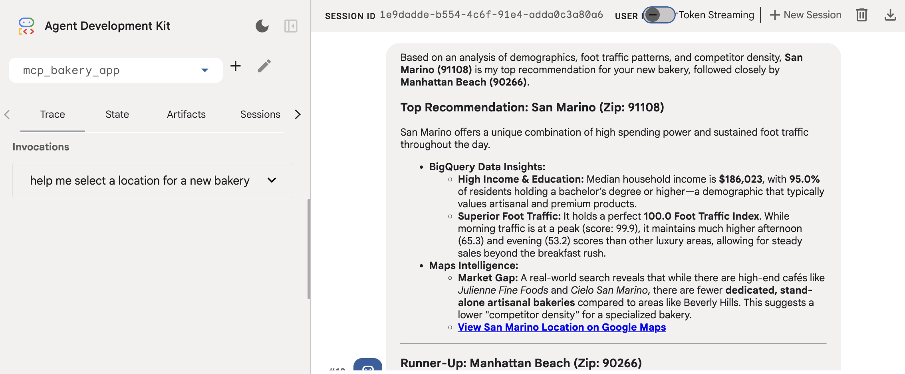

# Building a BigQuery & Google Maps Agent with Google ADK & MCP

:::{objectives}

- Understand how to connect to MCP server and call MCP tools
- Uses a real, working BigQuery agent to explore following foundational patterns
  - MCP Core Pattern
  - Agent Planner + Tools Pattern
  - Authentication Patterns for MCP
  - Tool Composition

:::

:::{exercise} What to build

An adk web agent that connects to Google's fully managed BigQuery and Maps MCP servers, authenticates using Application Default Credentials, and answers natural language questions about data stored in BigQuery

:::

## MCP Core Pattern

:::{note}

**MCP (Concept):**

- MCP design separates the AI application from its tool integrations
- MCP help create a modular and extensible approach to AI apps and tool development
- Core architectural components
  - MCP Host (AI application)
  - MCP Server (adapter or a proxy for an external tool, data source, or API)
  - MCP Client (maintains the active connection with the Server)

:::

### Operationalizing MCP 

- Agent never imports a BigQuery & Google maps Python library directly. Instead, connect to a server that exposes operations as MCP tools
- This decouples agent from the data source entirely
- Use ADK `McpToolset` to automatically connect, discover, adapt and proxy
- Connect
  - Opens a persistent HTTPS connection to the MCP server endpoint using `StreamableHTTPConnectionParams`
- Discover
  - Calls `list_tools` on the MCP server to get a manifest of all available tools and their input schemas
  - *Note: The `list_tools` method is an internal function of an MCP server used to advertise its capabilities to an Agent Development Kit (ADK) client. You would not typically call list_tools() directly as an end-user but rather configure your ADK agent to connect to an MCP server, upon which the agent will automatically discover and use the available tools*
- Adapt
  - Converts MCP tool schemas into ADK-native BaseTool objects that the `LlmAgent` can use.
- Proxy
  - When the agent calls a tool, McpToolset forwards the call via call_tool and returns the result.

## Agent Planner + Tools Pattern

- Keep the instruction focused on reasoning strategy, not data
- Agent doesn't hardcode column names or SQL in the instructions
  - Agent discover schema at runtime via the MCP tools
- This makes the agent resilient to schema changes

## Authentication Patterns

- BigQuery remote MCP (Model Context Protocol) servers use the OAuth 2.0 protocol with Google Cloud Identity and Access Management (IAM) for authentication and authorization
  - API keys are not supported.
- Use Application Default Credentials (ADC) — the Google Cloud standard
  - `gcloud auth application-default login` (in terminal)
  - `import google.auth.transport.requests` (import in agent; used in .refresh())

## Tool Composition - Multi-Tool Agents

- Composing multiple tool servers enables agent to reason across completely different data domains in a single conversation turn
- i.e., Reason using data from BigQuery and Google maps MCP in a single conversation turn

## Implementation

:::{instructor-note} Agent

```python
"""
agent.py
--------
Bakery Location Intelligence Agent.

Uses two Google-managed MCP servers:
  1. BigQuery MCP  — demographic, foot-traffic, pricing, and sales data
  2. Maps MCP      — place search, routing, and distance calculations

Run with:
    cd bakery_agent/       # parent directory of mcp_bakery_app/
    adk web .
"""

import os

import dotenv
from mcp_bakery_app import tools
import google.auth
from google.adk.agents import LlmAgent
from google.adk.models import Gemini
from google.genai import types

dotenv.load_dotenv()

# ── Project config ────────────────────────────────────────────────────────────
#PROJECT_ID = os.getenv("GOOGLE_CLOUD_PROJECT", "project_not_set")
DATASET    = "mcp_bakery"

_, project_id = google.auth.default()
os.environ["GOOGLE_CLOUD_PROJECT"] = project_id
os.environ["GOOGLE_CLOUD_LOCATION"] = "global"
os.environ["GOOGLE_GENAI_USE_VERTEXAI"] = "True"

# ── Initialise MCP toolsets ───────────────────────────────────────────────────
# Each call connects to the remote MCP server and discovers its tools.
# Toolsets are created once at module load time and reused across requests.
maps_toolset     = tools.get_maps_mcp_toolset()
bigquery_toolset = tools.get_bigquery_mcp_toolset()

# ── Agent definition ──────────────────────────────────────────────────────────
root_agent = LlmAgent(
    name="root_agent",
    model=Gemini(
        model="gemini-3-flash-preview",
        retry_options=types.HttpRetryOptions(attempts=3),
    ),
    instruction=f"""
You are an expert Bakery Location Intelligence Agent helping an entrepreneur
decide where to open a new bakery in the Los Angeles area.

You have access to two complementary data sources:

━━━━━━━━━━━━━━━━━━━━━━━━━━━━━━━━━━━━━━━━━━━━━━━━━━━━━━━━━
 1. BIGQUERY TOOLSET  — structured data in the `{DATASET}` dataset
━━━━━━━━━━━━━━━━━━━━━━━━━━━━━━━━━━━━━━━━━━━━━━━━━━━━━━━━━
Run all jobs from project: {project_id}
Always fully qualify table names: `{project_id}.{DATASET}.TABLE_NAME`

Available tables and their purpose:
  • demographics          — zip_code, neighborhood, median_household_income,
                            total_population, median_age, bachelors_degree_pct,
                            foot_traffic_index
  • foot_traffic          — zip_code, time_of_day (morning/afternoon/evening),
                            foot_traffic_score
  • bakery_prices         — store_name, product_type, price, region, is_organic
  • sales_history_weekly  — week_start_date, store_location, product_type,
                            quantity_sold, total_revenue

Workflow for BigQuery questions:
  1. Use get_dataset_info to confirm the dataset exists.
  2. Use get_table_info to inspect schema before writing SQL.
  3. Use execute_sql to run SQL and retrieve results.
  4. If a query errors, read the error message, fix the SQL, and retry.

━━━━━━━━━━━━━━━━━━━━━━━━━━━━━━━━━━━━━━━━━━━━━━━━━━━━━━━━━
 2. MAPS TOOLSET  — real-world location intelligence
━━━━━━━━━━━━━━━━━━━━━━━━━━━━━━━━━━━━━━━━━━━━━━━━━━━━━━━━━
Use for:
  • Searching for bakeries, cafés, or competitors in a specific area
  Find the region with the highest foot traffic and lowest competitor density.

Always include a hyperlink to an interactive Google Maps view in your
response when showing location-based results.

━━━━━━━━━━━━━━━━━━━━━━━━━━━━━━━━━━━━━━━━━━━━━━━━━━━━━━━━━
RESPONSE GUIDELINES
━━━━━━━━━━━━━━━━━━━━━━━━━━━━━━━━━━━━━━━━━━━━━━━━━━━━━━━━━
• Combine data insights with real-world location context in every answer.
• Be specific — cite zip codes, neighbourhoods, dollar amounts, and scores.
• Format numbers clearly: currency as $X.XX, percentages as X.X%.
• When you recommend a location, justify it with at least two data points
  from BigQuery AND one real-world observation from Maps.
• Keep responses concise but complete. Use bullet points for comparisons.
""",
    tools=[maps_toolset, bigquery_toolset],
)

```

:::

:::{instructor-note} Tool collection

```python
"""
tools.py
--------
MCP toolset factory functions for the Bakery Location Agent.

Two remote Google-managed MCP servers are used:
  - BigQuery MCP  : https://bigquery.googleapis.com/mcp
  - Maps MCP      : https://mapstools.googleapis.com/mcp

Authentication
  - BigQuery uses Application Default Credentials (ADC).
    Run once before starting the agent:
        gcloud auth application-default login
  - Maps uses a plain API key injected as an X-Goog-Api-Key header.
    Set MAPS_API_KEY in your .env file.
"""

import os

import dotenv
import google.auth
import google.auth.transport.requests

from google.adk.tools.mcp_tool.mcp_toolset import McpToolset
from google.adk.tools.mcp_tool.mcp_session_manager import StreamableHTTPConnectionParams

# ── MCP server endpoints (Google-managed, no infra to run) ──────────────────
BIGQUERY_MCP_URL = "https://bigquery.googleapis.com/mcp"
MAPS_MCP_URL     = "https://mapstools.googleapis.com/mcp"


# ── Maps toolset ─────────────────────────────────────────────────────────────

def get_maps_mcp_toolset() -> McpToolset:
    """
    Connect to the Google Maps Platform MCP server.

    Auth: API key passed as X-Goog-Api-Key header.
    The MAPS_API_KEY env var must be set in .env (or the shell environment).

    Tools exposed by this server (selection):
    """
    dotenv.load_dotenv()
    maps_api_key = os.getenv("MAPS_API_KEY", "no_api_key_found")

    toolset = McpToolset(
        connection_params=StreamableHTTPConnectionParams(
            url=MAPS_MCP_URL,
            headers={
                "x-goog-api-key": maps_api_key,
            },
        )
    )
    print("✅ Maps MCP toolset configured (Streamable HTTP).")
    return toolset


# ── BigQuery toolset ──────────────────────────────────────────────────────────

def get_bigquery_mcp_toolset() -> McpToolset:
    """
    Connect to the Google BigQuery MCP server using Application Default Credentials.

    Auth: OAuth 2.0 Bearer token generated from ADC, refreshed on every call
    so the agent always starts with a valid token.
    Also passes x-goog-user-project so BigQuery bills the correct project.

    ⚠  Token lifetime is ~60 min. If adk web runs longer, restart the agent
       after re-authenticating:  gcloud auth application-default login

    Tools exposed by this server (selection):
      - list_dataset_ids
      - get_dataset_info
      - list_table_ids
      - get_table_info
      - execute_sql
    """
    credentials, project_id = google.auth.default(
        scopes=["https://www.googleapis.com/auth/bigquery"]
    )

    # Force a refresh so the token is valid at agent startup
    credentials.refresh(google.auth.transport.requests.Request())
    oauth_token = credentials.token

    toolset = McpToolset(
        connection_params=StreamableHTTPConnectionParams(
            url=BIGQUERY_MCP_URL,
            headers={
                "Authorization":     f"Bearer {oauth_token}",
                "x-goog-user-project": project_id,
            },
        )
    )
    print("✅ BigQuery MCP toolset configured (Streamable HTTP).")
    return toolset


```

:::

## Deployment

```none
uv run adk web . --no-reload
```

**Terminal output:**

```none
INFO:     Started server process [9643]
INFO:     Waiting for application startup.

+-----------------------------------------------------------------------------+
| ADK Web Server started                                                      |
|                                                                             |
| For local testing, access at http://127.0.0.1:8000.                         |
+-----------------------------------------------------------------------------+

INFO:     Application startup complete.
INFO:     Uvicorn running on http://127.0.0.1:8000 (Press CTRL+C to quit)
```

## Output

:::{instructor-note} Output



:::
