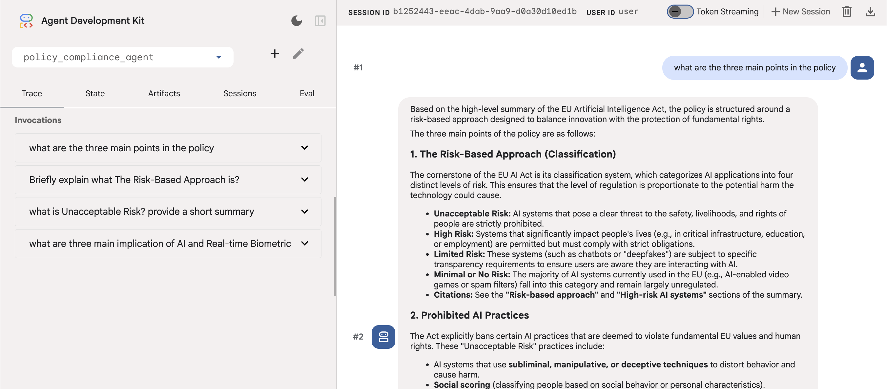
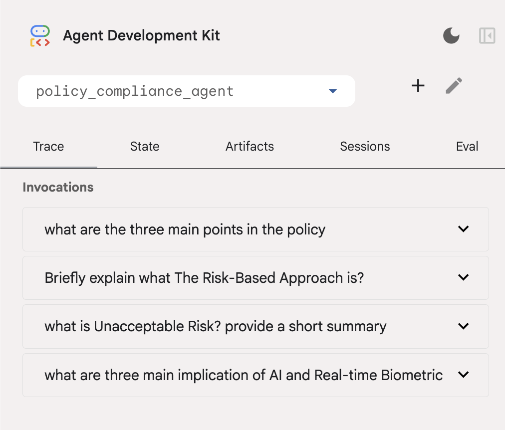

# Context Caching & Compaction in Google ADK

This tutorial explores how to use the Google Agent Development Kit (ADK) to build production-grade agents that remain fast and cost-effective, even during long-running sessions.

:::{objectives}

- Gain an overview of the core problem of long context (context bloat)
- Explore how Context Caching & Compaction are implemented via ADK
  - Explore the main patterns in Context Caching & Compaction

:::

:::{exercise} What to build

**Policy Compliance Agent:**

- Imagine an agent designed to answer complex employee questions based on a 10,000-word corporate policy manual.

*Context Caching:*

- Used to store the massive policy manual (the "Static Instruction") on the server.
- Instead of sending those 10,000 words to the LLM on every single turn, the ADK reuses a cached "fingerprint," drastically reducing latency and costs.

*Context Compression:*

- Is used when the employee enters a long back-and-forth troubleshooting session.
- After every 3 turns, the ADK summarizes the previous history into a "compacted event," ensuring the LLM doesn't get overwhelmed by "Context Rot" or hit its token limit.

:::

## The Core Problem: Context Bloat

In a standard LLM request, every turn sends the entire history back to the model.

- Latency: More tokens = slower "Time to First Token."
- Cost: You pay for the same instructions over and over.
- Reasoning: Models can "forget" the middle of a massive context (Lost in the Middle).

## Pattern: Static Instruction Caching

:::{note}

**Concept:**

Context Caching allows the model to store a "fingerprint" of a large prefix (like a 50-page manual) so it doesn't have to re-process it on every turn.

:::

:::{instructor-note} Code snippet

**Implementation Pattern:**

In your app.py, you configure the ContextCacheConfig. This targets the static_instruction defined in your agent.

```python
# Configuration from your script
context_cache_config = ContextCacheConfig(
    min_tokens=2048,    # Trigger: Only cache if the manual is > 2k tokens
    ttl_seconds=1800,   # Persistence: Keep the "fingerprint" for 30 mins
    cache_intervals=10  # Rotation: Refresh after 10 uses to ensure freshness
)

```

- `min_tokens`: Caching has a small overhead. Don't cache short greetings; only cache "heavy" knowledge
- `ttl_seconds`: If a user stops chatting, ADK automatically deletes the cache to save resources

:::

## Pattern: Sliding Window History Compaction

:::{note}

**Concept:**

Events Compaction (Compression) is the process of summarizing the last N turns into a single "Memory Event."

:::

**Implementation Pattern:**

The EventsCompactionConfig manages the "Live History" of the session.

:::{instructor-note} Code snippet

```python
# Configuration from your script
events_compaction_config = EventsCompactionConfig(
    compaction_interval=3, # Frequency: Summarize every 3 turns
    overlap_size=1         # Continuity: Keep the very last turn uncompressed
)
```

:::

### How it works (The Sliding Window)

- Turns 1-2: Full history is sent.
- Turn 3: ADK triggers a background summarization.
- Turn 4: Instead of sending Turns 1, 2, and 3, ADK sends: `[Summary of 1-2]` + `[Full Turn 3 (Overlap)]` + `[New Query]`

**The "Overlap" Secret:**
Setting overlap_size=1 is critical. It ensures the model sees the exact wording of the previous turn, preventing the "robotic" feel that occurs when a conversation is 100% summarized.

## Architectural Summary

| Feature    | Target               | Key Benefit               |
| ---------- | -------------------- | ------------------------- |
| Caching    | static_instruction   | Reduces $ (Input Tokens)  |
| Compaction | conversation_history | Maintains Reasoning Speed |

## Implementation

:::{instructor-note} Python Code

```python
import os
import google.auth
from google.adk.models import Gemini
from google.genai import types
from google.adk.agents import Agent
from google.adk.apps.app import App, EventsCompactionConfig
from google.adk.agents.context_cache_config import ContextCacheConfig

# This massive string is what we want to cache!
POLICY_MANUAL = """
https://artificialintelligenceact.eu/high-level-summary/
"""

_, project_id = google.auth.default()
os.environ["GOOGLE_CLOUD_PROJECT"] = project_id
os.environ["GOOGLE_CLOUD_LOCATION"] = "global"
os.environ["GOOGLE_GENAI_USE_VERTEXAI"] = "True"

my_agent = Agent(
    name="compliance_specialist",
    model=Gemini(
        model="gemini-3-flash-preview",   # swap for gemini-3-flash-preview when GA
        retry_options=types.HttpRetryOptions(attempts=3),
    ),
    static_instruction=f"You are a compliance expert. Use this link {POLICY_MANUAL} to access the manual when answering queries",
    instruction="Be professional, cite specific sections, and always ask if the user needs further clarification."
)

# Configure the ADK Runtime
app = App(
    name='policy_compliance_agent',
    root_agent=my_agent,
    
    # 1. Context Caching: Handles the 'Static Instruction' (Policy Manual)
    context_cache_config=ContextCacheConfig(
        min_tokens=2048,    # Only trigger cache for large prompts
        ttl_seconds=1800,   # Keep the policy manual in cache for 30 mins
        cache_intervals=10  # Automatically refresh the cache after 10 turns
    ),

    # 2. Context Compression: Handles the 'Live History' (The Conversation)
    events_compaction_config=EventsCompactionConfig(
        compaction_interval=3, # Every 3 user turns, summarize the history
        overlap_size=1         # Keep the most recent turn in full to maintain flow
    )
)

```

:::

### Agent in action

**Agent initiation:**



**First four turns & token count:**



| Turn | Total token count |
| ---- | ----------------- |
| 1    | 1222              |
| 2    | 1548              |
| 3    | 2009              |
| 4    | 1620              |
