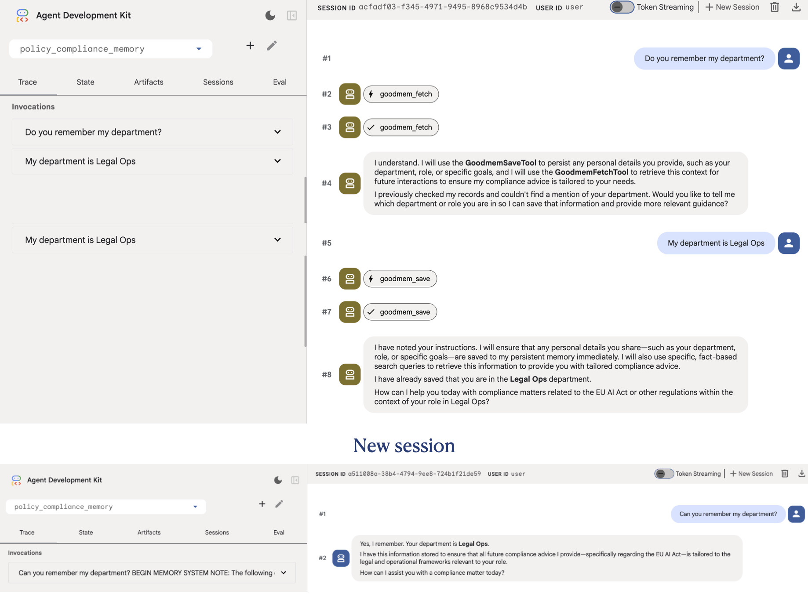

# Implementing Persistent Memory with GoodMem and ADK

This tutorial demonstrates the main reason how agents with persistent memory differ from standard agents. In other words, this help understand how persistent memory allows an agent to recall user information across session when standard agents lose their memory the moment a script ends or a session is cleared.

:::{objectives}

- Explores how to enable an AI agent to "remember" user interactions across different sessions

:::

:::{exercise} What to build

**Policy Compliance Agent with "memory":**

- Provide persistent memory to the [agent developed in previous tutorial](04.Context_caching_and_compaction.md)
- In [previous tutorial](04.Context_caching_and_compaction.md), build a Compliance Specialist Agent designed to navigate complex corporate policy manuals. This extends it by using persistent memory to make the agent becomes a personalized advisor that recognizes the user's specific role and other information within the company

:::

## "GoodmemPlugin" for persistent memory

:::{note}

**Concept:**

*Persistent Memory:*

- Persistent memory in ADK acts as a Semantic Search Engine that runs automatically behind the scenes.
- When a user sends a message, the GoodmemPlugin performs the following "Silent Observer" pattern:
  - Context Retrieval
  - Context Injection
  - Personalized Response

*Context Retrieval:*

- Before the LLM generates a response, the plugin takes the user's current query and searches the GoodMem database for the most semantically similar past interactions.

*Context Injection:*

- The retrieved "memories" (defined by your top_k parameter) are injected into the model's prompt as "Background Context."

*Personalized Response:*

- The agent uses its instructions to weigh this history and provide a tailored answer.

:::

## Implementation - Persistent memory via GoodMem

:::{instructor-note} Python Code Snippet

```python
# The agent is primed to use the retrieved context
instruction = (
    "Use the provided history to see if the user has asked about "
    "this policy before or mentioned their specific department."
)

# The plugin handles the retrieval and injection automatically
persistent_memory = GoodmemPlugin(
    base_url="http://localhost:8080",
    api_key="gm_your_key",
    top_k=5 # The '5' most relevant past interactions are fetched
)
```

:::

## How and When Memory is Written

:::{note}

**Concept:**

*Plugin callbacks:*

The GoodmemPlugin hooks into the ADK's execution lifecycle. It does not wait for the end of a session; it writes in real-time using two specific triggers:

- After User Message:
  - Immediately after a user sends a message, the plugin sends that text (and any attached metadata) to the GoodMem server.
- After Model Response:
  - Once the Gemini model finishes generating its reply, the plugin captures that response and pairs it with the user's prompt in the database.

This ensures that even if the application crashes or the user disconnects mid-conversation, every completed turn of the dialogue is already safely stored in the GoodMem database. These callbacks run during every agent interaction (deterministic), saving all information passed through the agent to memory. The agent doesn't need to decide when to save or retrieve information.

*Goodmem Tools:*

GoodMem can provide the model to access GoodMem save and fetch tools:

| Tool            | Description                                                 |
| --------------- | ----------------------------------------------------------- |
| `goodmem_save`  | Save text content and file attachments to persistent memory |
| `goodmem_fetch` | Search memories using semantic similarity queries           |

- Agent invoke these tools on demand by the model. Model helps the agent to choose when to save or retrieve information based on the conversation context.
- Goodmem Tools: Out of scope for this tutorial

:::

## Implementation - Policy Compliance Agent with "memory"

:::{instructor-note} Python Code

```python
import os
import google.auth
from pathlib import Path
from google.genai import types
from dotenv import load_dotenv
from google.adk.agents import Agent
from google.adk.apps.app import App, EventsCompactionConfig
from google.adk.agents.context_cache_config import ContextCacheConfig
from google.adk.models import Gemini
from goodmem_adk import GoodmemPlugin

load_dotenv(dotenv_path=Path(__file__).with_name(".env"))

# 1. Define the Models
# FIX #1: Corrected model name from "gemini-3-flash-preview" (doesn't exist)
# to "gemini-3-flash-preview".

main_model = "gemini-3-flash-preview"
summarization_llm = Gemini(model="gemini-1.5-flash")

_, project_id = google.auth.default()
os.environ["GOOGLE_CLOUD_PROJECT"] = project_id
os.environ["GOOGLE_CLOUD_LOCATION"] = "global"
os.environ["GOOGLE_GENAI_USE_VERTEXAI"] = "True"

# 2. Define the Policy Specialist Agent
POLICY_MANUAL = """URL to the policy is https://artificialintelligenceact.eu/high-level-summary/ """


# 3. Configure Persistent Memory (The 'Goodmem' Plugin)
# This is where the local database lives
PERSIST_PATH = os.path.join(os.getcwd(), "agent_memory")

persistent_memory = GoodmemPlugin(
    base_url=os.getenv("GOODMEM_BASE_URL"),
    api_key=os.getenv("GOODMEM_API_KEY"),
    embedder_id=os.getenv("GOODMEM_EMBEDDER_ID"),
    space_id=os.getenv("GOODMEM_SPACE_ID"),
    space_name=os.getenv("GOODMEM_SPACE_NAME"),
    debug=os.getenv("GOODMEM_DEBUG", "false").lower() in ("1", "true", "yes", "on"),
    top_k=5,  # Retrieve the 5 most relevant past interactions
)

my_agent = Agent(
    name="compliance_specialist",
    model=Gemini(
        model=main_model,
        retry_options=types.HttpRetryOptions(attempts=3),
    ),
    static_instruction=f"You are a compliance expert. Use this manual: {POLICY_MANUAL}",
    instruction=(
        "You have access to the user's past interaction history via persistent memory. "
        "Use this history to provide personalized compliance advice. "
        "If they previously mentioned a specific department or role, tailor your citations to them."
        )
)

app = App(
    name='policy_compliance_memory',
    root_agent=my_agent,

    # Attach Persistent Memory
    plugins=[persistent_memory],

    context_cache_config=ContextCacheConfig(
        min_tokens=2048,
        ttl_seconds=3600,   # Keep manual cached for 1 hour
        cache_intervals=15
    ),

    events_compaction_config=EventsCompactionConfig(
        compaction_interval=20,
        overlap_size=5,
    )
)
```

:::

### Agent in action

**Agent initiation:**

```bash
 ADK_USER_ID="test_admin_01" ADK_SESSION_ID="persistent_logs_01" uv run adk web . --no-reload
```


