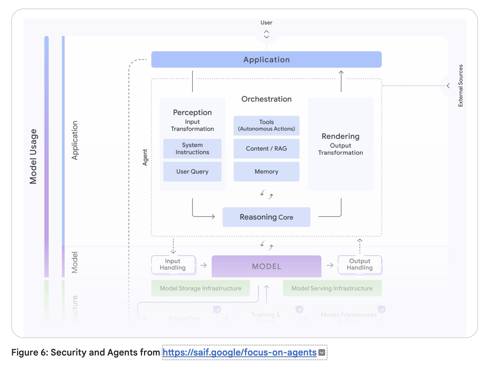

# Foundations of AI Agentic Architectures and Production Systems

## The Paradigm Shift: From Predictive AI to Autonomous Agents

- We are moving beyond "Predictive AI"—systems that operate in a passive, discrete paradigm to translate text or generate images—toward "Autonomous Agents"
- This shift represents a move from the traditional "bricklayer" development model, where engineers define every logical step via explicit code, to a "director" model
- In this new era, the developer orchestrates an autonomous "actor" by
  - setting the scene through guiding instructions
  - selecting a cast of specialized tools, and
  - curating the necessary context to achieve high-level goals

## Model-Centric vs. Agentic-Centric

| Feature        | Model-Centric (Passive AI)                        | Agentic-Centric (AI Agents)                                               |
| -------------- | ------------------------------------------------- | ------------------------------------------------------------------------- |
| Autonomy       | Requires human direction for every discrete step. | Capable of autonomous planning and multi-step execution.                  |
| Task Handling  | Static workflows; input-to-output mapping.        | Complex, goal-oriented missions with dynamic adaptation.                  |
| Execution Loop | Linear (Input → Model → Output).                  | Cyclical (Think → Act → Observe).                                         |
| Interaction    | Predictive or creative content generation.        | Practical agency; the ability to change the state of the world via tools. |

## Defining the Agent

- An agent is not merely a model
  - it is the natural evolution of Language Models (LMs) synthesized into functional software

### Core components of an agent

1. The Model (The Brain)
     - The reasoning engine that processes information and makes decisions.
2. Tools (The Hands):
     - Interfaces (APIs, data stores) that connect reasoning to reality.
3. The Orchestration Layer (The Nervous System):
     - The state machine that manages the operational loop, memory, and strategy.
4. Runtime Services (The Body and Legs):
     - The production infrastructure (hosting, logging, monitoring) that ensures reliability and accessibility

Understanding this definition is the prerequisite for exploring how these systems systematically solve complex, non-deterministic problems.

## The Mechanics of Agency: The 5-Step Operational Loop

*Source: Introduction to Agents; Authors: Alan Blount, Antonio Gulli, Shubham Saboo,
Michael Zimmermann, and Vladimir Vuskovic*

Maintain the assurance that the agent remains tethered to the mission ("grounding") despite the probabilistic nature of the underlying model. The "Think, Act, Observe" cycle allows for continuous refinement as the agent interacts with its environment

### The 5-Step Cycle

- Get the Mission:
  - The process is initiated by a high-level goal (e.g., "Organize team travel").
- Scan the Scene:
  - The agent perceives its environment by accessing memory and available resources.
- Think It Through:
  - The reasoning model analyzes the mission against the scene to devise a plan.
- Take Action:
  - The agent executes a concrete step, such as an API call or database query.
Observe and Iterate: The agent records the result of the action and feeds it back into the reasoning engine.

### Case Study: Customer Support (Order #12345)

- A user asks: "Where is my order?"
- Think: The agent recognizes it needs delivery status.
  - It plans to (1) Find order, (2) Track carrier, (3) Report.
  - Act/Observe (Step 1): Invokes find_order, observes tracking number "ZYX987."
  - Act/Observe (Step 2): Invokes get_shipping_status, observes "Out for Delivery."
  - Report: Synthesizes the final response: "Your order is arriving today."

While the loop is constant, the sophistication of its execution determines the agent's capability level.

## A Taxonomy of Intelligence: Levels 0-4 of Agentic Systems

- Classifying agents is critical when scoping projects to manage the trade-offs between system complexity and autonomous capability.
- A central differentiator across these levels is Context Engineering:
- Context Engineering: the art of context window curation

- Level 0: The Core Reasoning System (The Isolated Brain)
  - A Language Model operating solely on pre-trained knowledge.
  - It is "blind" to real-time events (e.g., knowing baseball rules but not last night’s score)
- Level 1: The Connected Problem-Solver (Retrieval/Tools)
  - The brain gains "hands."
  - It uses the 5-step loop to access real-time data via search APIs or RAG (Retrieval-Augmented Generation)
- Level 2: The Strategic Problem-Solver (Context Engineering)
  - The agent performs complex, multi-part goals.
  - It uses context engineering to select and package the most relevant data for each step
  - Enable proactive assistance and intent refinement
- Level 3: The Collaborative Multi-Agent System (Division of Labor)
  - A "team of specialists" approach
  - A coordinator agent delegates missions to specialized sub-agents (e.g., Market Research vs. Web Dev), mirroring a human organization
- Level 4: The Self-Evolving System (Autonomous Tool Creation)
  - The frontier. The system identifies capability gaps and autonomously creates new tools or agents (e.g., writing a new Python script to solve a novel math problem) to expand its own resources.

Moving through these levels requires a deep dive into the "Tripartite Architecture" of the Brain, Hands, and Nervous System.

## The Core Anatomy: Model, Tools, and Orchestration

### The Brain (The Model)

- Benchmark scores are insufficient for agentic tasks
- Success requires models that excel at reasoning and reliable tool use

#### Strategic Model Routing

- Optimize the intersection of quality, speed, and price, architects should use a "team of specialists."
- A frontier model like Gemini 2.5 Pro should be routed for heavy-duty planning,
  - while the faster, more cost-effective Gemini 2.5 Flash handles intent classification and summarization.
  - This avoids the "sledgehammer" approach to simple tasks.

#### Cognitive Ceiling vs. Operational Cost

- The model you choose today will be superseded in months
- Building a nimble "Agent Ops" practice allows for upgrading the "Brain" without overhauling the entire architecture

### The Hands (The Tools)

- Tools provide the model's connection to reality
- These connections are categorized as:
  - Retrieving Information: Grounding the agent via RAG (Vector Databases) or NL2SQL (Structured Databases).
  - Executing Actions: Changing the world via APIs or Python sandboxes.
  - Computer Use: A critical frontier where the LM takes control of a user interface—navigating pages and pre-filling forms—often with Human-in-the-Loop oversight.

### The Nervous System (The Orchestration Layer)

- The orchestrator is the state machine governing the agent's behavior (Spectrum of Autonomy)
- Orchestration Layer
  - Engine that runs the "Think, Act, Observe" loop
- Implementation: Ranges from deterministic, predictable workflows (AI as a tool) to "LM in the driver's seat" (dynamic planning)
- ADK: Code-first frameworks like the Agent Development Kit (ADK) provide the granular control and observability required for mission-critical enterprise systems

## Agent Ops: Managing the Stochastic Lifecycle

- Traditional unit testing (output == expected) fails for probabilistic systems
- Agent Ops is the evolution of MLOps for managing this unpredictability

### Metrics-Driven Development

- Success is measured by business-aligned KPIs:
  - Goal completion rates,
  - Cost per interaction, and
  - Task latency.

### Quality Assessment (LM as Judge)

- Since pass/fail is impossible, a powerful model evaluates agent outputs against a Golden Dataset (curated prompts/responses) using a rubric for factuality and tone

### OpenTelemetry Traces

- Traditional breakpoints are ineffective
- Architects use *traces to record the agent's trajectory*
  - with step-by-step reasoning,
  - tool calls, and
  - observations—to identify where the logic deviated.

### Closing the Loop

- Human feedback (e.g., "thumbs down") must be captured and converted into new permanent test cases in the evaluation dataset to prevent regression.

*Source: https://medium.com/@sokratis.kartakis/genai-in-production-mlops-or-genaiops-25691c9becd0*

## The Interoperability Frontier: Humans, Agents, and Money

- Scaling an agentic economy requires standardized communication protocols to move beyond simple chatbots
- Humans and Agents:
  - Interaction is shifting to multimodal live mode (e.g., Gemini Live API), where agents see and hear in real-time, allowing for natural collaboration and "Computer Use" oversight.
- Agent-to-Agent (A2A):
  - Discovery is enabled via the Agent Card—a digital business card in JSON format specifying the agent's capabilities, network endpoint, and security credentials.
- Agents and Money:
  - To solve the "crisis of trust" in autonomous transactions, we utilize AP2 (cryptographically signed digital mandates for authorization) and x402 (standardized HTTP 402 protocols for machine-to-machine micropayments).

## Security and Governance: Hardening the Agentic Frontier

- The "Trust Trade-Off" dictates that as agents gain autonomy, risk increases

### Agent Identity: A New Class of Principal

| Principal Entity | Authentication | Notes                                                         |
| ---------------- | -------------- | ------------------------------------------------------------- |
| Users            | OAuth / SSO    | Human actors; full autonomy/responsibility.                   |
| Agents           | SPIFFE         | Delegated authority; actions on behalf of users.              |
| Service Accounts | IAM            | Fully deterministic; no delegated responsibility for actions. |

### Hybrid Defense Strategy

#### Deterministic Guardrails

- Hardcoded policy engines (e.g., "deny all DELETE commands")
- Reasoning-Based Defenses:
  - Managed services like Model Armor to screen prompts and plans for injection attacks, jailbreaks, and PII (Personally Identifiable Information) leakage.
- Control Plane:
  - Preventing "Agent Sprawl" through a centralized gateway and registry for runtime policy enforcement and discovery.

## The Future: Self-Evolving Systems and Case Studies

- The final frontier

### Learning Agent Loop

- Combine runtime artifacts (logs/traces) and human feedback to autonomously refine context engineering and tool usage.

### Agent Gym

- A standalone, offline simulation environment that is not in the execution path.
- It allows agents to "exercise" on synthetic data and pressure-test optimizations before production deployment.

### Advanced Case Studies

- Google Co-Scientist:
  - A multi-agent ecosystem where a "Supervisor" manages specialized agents to explore complex problem spaces, grounding scientific hypotheses in proprietary and public knowledge.
AlphaEvolve:
    An evolutionary agentic system that generates human-readable code. It has achieved breakthroughs in improving Google’s data center efficiency, optimizing chip design, and discovering faster matrix multiplication algorithms.
