# Foundations of AI Agentic Architectures and Production Systems

:::{objectives}

- Understand what AI agents are and their main components
- 

:::

## The Paradigm Shift: From Predictive AI to Autonomous Agents

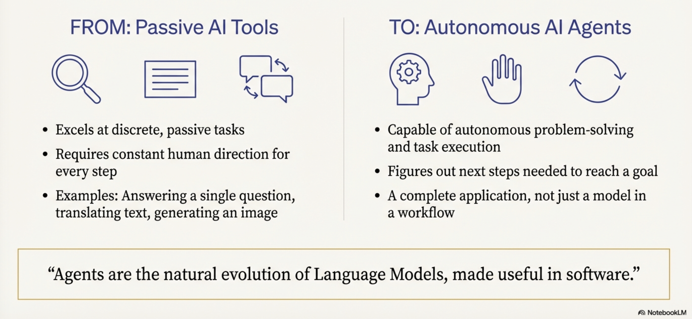{width=1000px}

- We are moving beyond "Predictive AI"—systems that operate in a passive, discrete paradigm to translate text or generate images—toward "Autonomous Agents"
- This shift represents a move from the traditional "bricklayer" development model, where engineers define every logical step via explicit code, to a "director" model
- In this new era, the developer orchestrates an autonomous "actor" by
  - setting the scene through guiding instructions
  - selecting a cast of specialized tools, and
  - curating the necessary context to achieve high-level goals

## Model-Centric vs. Agentic-Centric

| Feature        | Model-Centric (Passive AI)                        | Agentic-Centric (AI Agents)                                               |
| -------------- | ------------------------------------------------- | ------------------------------------------------------------------------- |
| Autonomy       | Requires human direction for every discrete step. | Capable of autonomous planning and multi-step execution.                  |
| Task Handling  | Static workflows; input-to-output mapping.        | Complex, goal-oriented missions with dynamic adaptation.                  |
| Execution Loop | Linear (Input → Model → Output).                  | Cyclical (Think → Act → Observe).                                         |
| Interaction    | Predictive or creative content generation.        | Practical agency; the ability to change the state of the world via tools. |

## Defining the Agent

- An agent is not merely a model
  - it is the natural evolution of Language Models (LMs) synthesized into functional software

### Core components of an agent

1. The Model (The Brain)
     - The reasoning engine that processes information and makes decisions.
2. Tools (The Hands):
     - Interfaces (APIs, data stores) that connect reasoning to reality.
3. The Orchestration Layer (The Nervous System):
     - The state machine that manages the operational loop, memory, and strategy.
4. Runtime Services (The Body and Legs):
     - The production infrastructure (hosting, logging, monitoring) that ensures reliability and accessibility

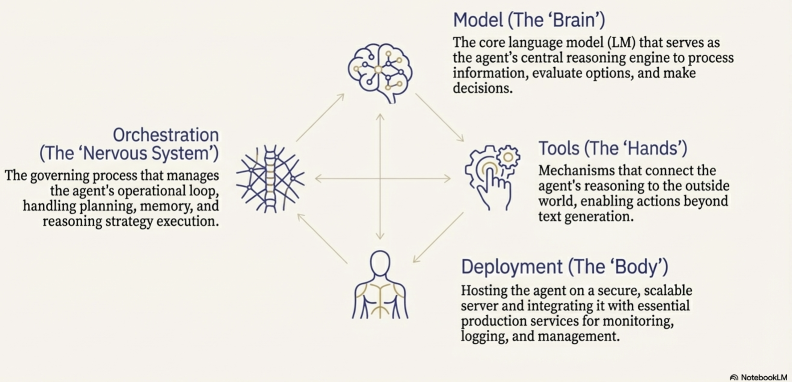{width=1000px}

Understanding this definition is the prerequisite for exploring how these systems systematically solve complex, non-deterministic problems.

## The Mechanics of Agency: The 5-Step Operational Loop

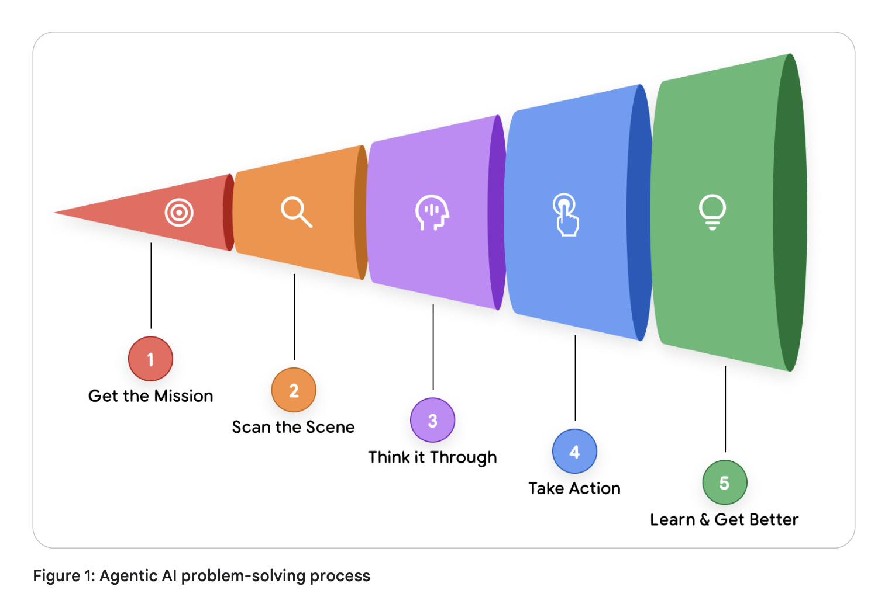{width=1000px}
*Source: Introduction to Agents; Authors: Alan Blount, Antonio Gulli, Shubham Saboo,
Michael Zimmermann, and Vladimir Vuskovic*

Maintain the assurance that the agent remains grounded to the mission despite the probabilistic nature of the underlying model. The "Think, Act, Observe" cycle allows for continuous refinement as the agent interacts with its environment

### The 5-Step Cycle

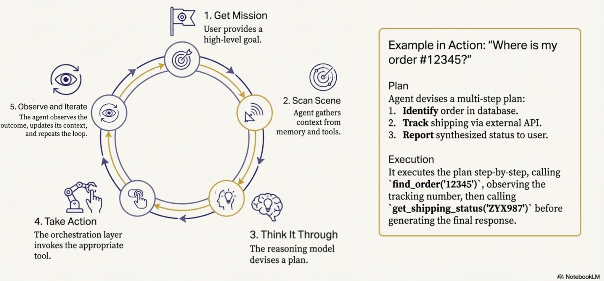{width=1000px}

- Get the Mission:
  - The process is initiated by a high-level goal (e.g., "Organize team travel").
- Scan the Scene:
  - The agent perceives its environment by accessing memory and available resources.
- Think It Through:
  - The reasoning model analyzes the mission against the scene to devise a plan.
- Take Action:
  - The agent executes a concrete step, such as an API call or database query.
Observe and Iterate: The agent records the result of the action and feeds it back into the reasoning engine.

## A Taxonomy of Intelligence

- Classifying agents is critical when scoping projects to manage the trade-offs between system complexity and autonomous capability.
- A central differentiator across these levels is Context Engineering:
- Context Engineering: the art of context window curation

### Context engineering

- **Context engineering** is the modern evolution of what was formerly known as "prompt engineering".
- It is the practice of actively selecting, packaging, and managing the exact information a Language Model (LM) needs to generate a desired output.
  - For any single call to the LM, context engineering involves carefully curating the input window with a precise blend of elements like
    - system instructions,
    - user input,
    - available tools,
    - session history,
    - factual grounding from authoritative sources,
    - user profiles, and the
    - results of previously invoked tools

**key aspects of context engineering:**

- Optimizing the Model's Attention:
  - An agent's accuracy relies entirely on a focused, high-quality context.
  - Context engineering curates the model's limited attention, preventing information overload and ensuring efficient, accurate performance.
- The Core Function of an Agent:
  - In essence, AI agents are software systems dedicated entirely to the art of context window curation.
- The Orchestration Layer manages a loop of
  - assembling this context,
  - prompting the model,
  - observing the results of any tool actions, and then
  - re-assembling a new, updated context for the next step.
- Emergence in Strategic Problem-Solvers:
  - Context engineering is the defining skill that emerges in "Level 2" agentic systems (Strategic Problem-Solvers).
  - For example, if an agent is asked to find a good coffee shop halfway between two locations, it first finds the halfway point (e.g., Millbrae, CA). It then uses context engineering to automatically translate that observation into a new, highly focused search query (e.g., `query="coffee shop in Millbrae, CA", min_rating=4.0`) to complete the next step.
- Continuous Autonomous Improvement:
  - "Enhanced Context Engineering" for self-evolving systems/agents.
  - The system autonomously and continuously refines its own prompts by learning from past experiences, session logs, and human feedback.

### Levels 0-4 of Agentic Systems

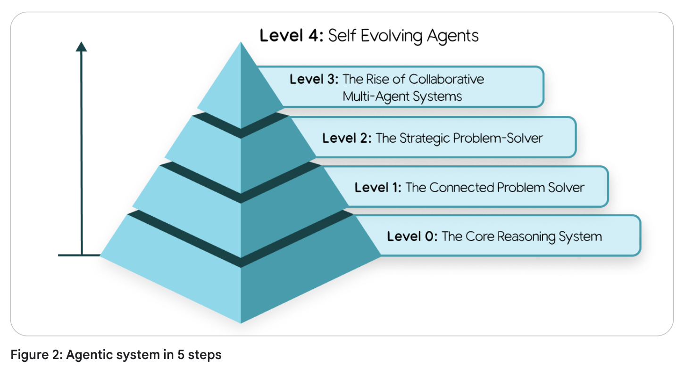{width=1000px}
*Source: Introduction to Agents; Authors: Alan Blount, Antonio Gulli, Shubham Saboo,
Michael Zimmermann, and Vladimir Vuskovic*

- Level 0: The Core Reasoning System (The Isolated Brain)
  - A Language Model operating solely on pre-trained knowledge.
  - It is "blind" to real-time events (e.g., knowing baseball rules but not last night’s score)
- Level 1: The Connected Problem-Solver (Retrieval/Tools)
  - The brain gains "hands."
  - It uses the 5-step loop to access real-time data via search APIs or RAG (Retrieval-Augmented Generation)
- Level 2: The Strategic Problem-Solver (Context Engineering)
  - The agent performs complex, multi-part goals.
  - It uses context engineering to select and package the most relevant data for each step
  - Enable proactive assistance and intent refinement
- Level 3: The Collaborative Multi-Agent System (Division of Labor)
  - A "team of specialists" approach
  - A coordinator agent delegates missions to specialized sub-agents (e.g., Market Research vs. Web Dev), mirroring a human organization
- Level 4: The Self-Evolving System (Autonomous Tool Creation)
  - The frontier. The system identifies capability gaps and autonomously creates new tools or agents (e.g., writing a new Python script to solve a novel math problem) to expand its own resources.

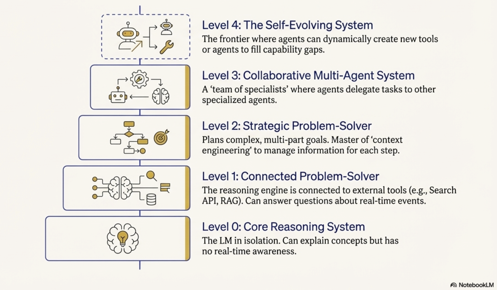{width=1000px}

Moving through these levels requires a deep dive into the "Tripartite Architecture" of the Brain, Hands, and Nervous System.

## The Core Anatomy: Model, Tools, and Orchestration

### The Brain (The Model)

- Benchmark scores are insufficient for agentic tasks
- Success requires models that excel at reasoning and reliable tool use

**Key considerations of a model in a AI agent:**

- Strategic Model Routing
  - Optimize the intersection of quality, speed, and price, architects should use a "team of specialists."
  - A frontier model like Gemini 2.5 Pro should be routed for heavy-duty planning,
    - while the faster, more cost-effective Gemini 2.5 Flash handles intent classification and summarization.
    - This avoids the "sledgehammer" approach to simple tasks.
- Cognitive Ceiling vs. Operational Cost
  - The model you choose today will be superseded in months
  - Building a nimble "Agent Ops" practice allows for upgrading the "Brain" without overhauling the entire architecture

### The Hands (The Tools)

- Tools provide the model's connection to reality
- These connections are categorized as:
  - Retrieving Information: Grounding the agent via RAG (Vector Databases) or NL2SQL (Structured Databases).
  - Executing Actions: Changing the world via APIs or Python sandboxes.
  - Computer Use: A critical frontier where the LM takes control of a user interface—navigating pages and pre-filling forms—often with Human-in-the-Loop oversight.

{width=1000px}

### The Nervous System (The Orchestration Layer)

- The orchestrator is the state machine governing the agent's behavior (Spectrum of Autonomy)
- Orchestration Layer
  - Engine that runs the "Think, Act, Observe" loop
- Implementation: Ranges from deterministic, predictable workflows (AI as a tool) to "LM in the driver's seat" (dynamic planning)
- ADK: Code-first frameworks like the Agent Development Kit (ADK) provide the granular control and observability required for mission-critical enterprise systems

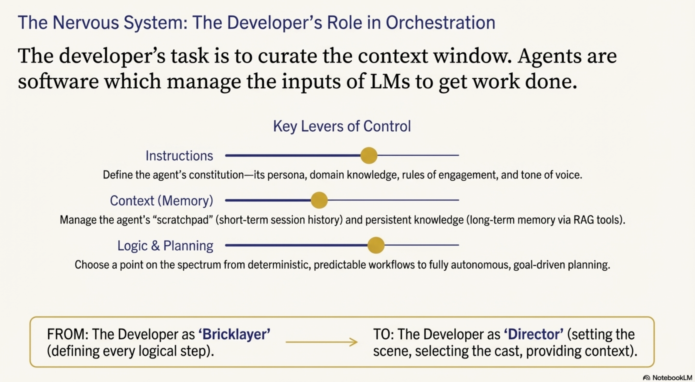{width=1000px}

## Agent Ops: Managing the Stochastic Lifecycle

- Standard DevOps and software development rely on unit tests that check if an output perfectly matches an expected result,
  - This approach fails with the probabilistic nature of generative AI
- Transition (from deterministic software to stochastic agentic systems) requires a new operational philosophy.
- Agent Ops is the evolution of MLOps for managing this unpredictability
  - disciplined, structured approach
  - tailored for the unique challenges of building, deploying, and governing Al agents.

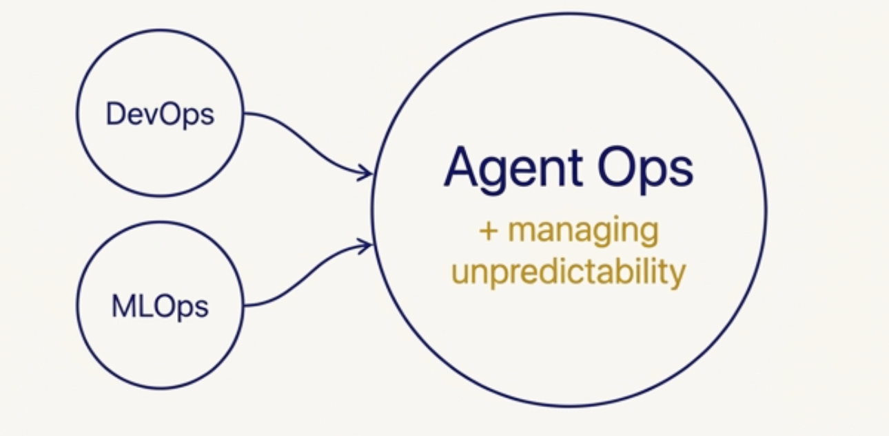{width=500px}

### Agent Ops Toolkit

1. Measure
   - Measurement and KPI Tracking
2. Evaluate
   - "LM as Judge" for Quality Evaluation
3. Improve
   - Metrics-Driven Development
4. Debug
   - OpenTelemetry Traces
   - Human feedback

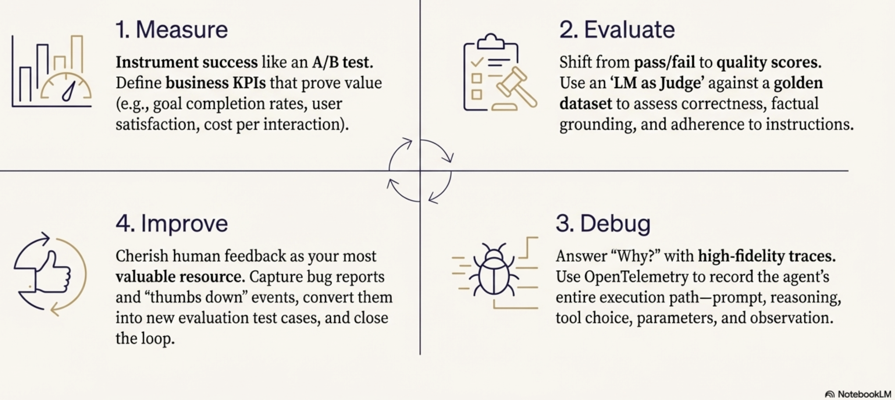{width=1000}

### Measurement and KPI Tracking

- Before an agent can be improved, its success must be defined like an A/B experiment
- Success can be measured by business-aligned KPIs:
  - Goal completion rates,
  - User satisfaction scores,
  - Cost per interaction, and
  - Task latency.
- Foundational tool in Agent Ops is a **top-down observability strategy that tracks Key Performance Indicators (KPIs) mapping directly to business value**.

### Quality Assessment (LM as Judge)

- Since pass/fail is impossible, a powerful model evaluates agent outputs against a Golden Dataset (curated prompts/responses) using a rubric (set of instructions or rules) for factuality and tone
- Agent Ops replaces traditional unit tests with an "LM as Judge"
- This involves using a powerful language model to assess the agent's output against a predefined rubric, asking questions like:
  - Did it give the right answer?
  - Was it factually grounded? Did it follow instructions?

### Metrics-Driven Development

- Agent Ops utilizes these quality scores to create a "Go/No-Go" gate for deployments
- When a developer makes changes, the new agent version is run against the entire evaluation dataset, and its scores are compared directly to the production version
- For maximum safety, teams use A/B deployments to slowly roll out the new agent and compare real-world production metrics (like latency and cost) alongside the simulated scores

### OpenTelemetry Traces

- When metrics dip or a bug is reported, developers need to know exactly why the agent failed.
- Agent Ops relies on OpenTelemetry traces, which provide a high-fidelity, step-by-step recording of the agent's entire execution trajectory
- Traces expose the full "thought process" of the agent, including:
  - The exact prompt sent to the model.
  - The model's internal reasoning.
  - The specific tool it chose to invoke and the parameters it generated.
  - The raw data it observed in return
- These detailed logs can be collected and visualized in platforms like Google Cloud Trace to streamline root cause analysis

### Human feedback for closing the Loop

- Human feedback (e.g., "thumbs down") must be captured and converted into new permanent test cases in the evaluation dataset to prevent regression.

### DevOps, MLOps, and GenAIOps

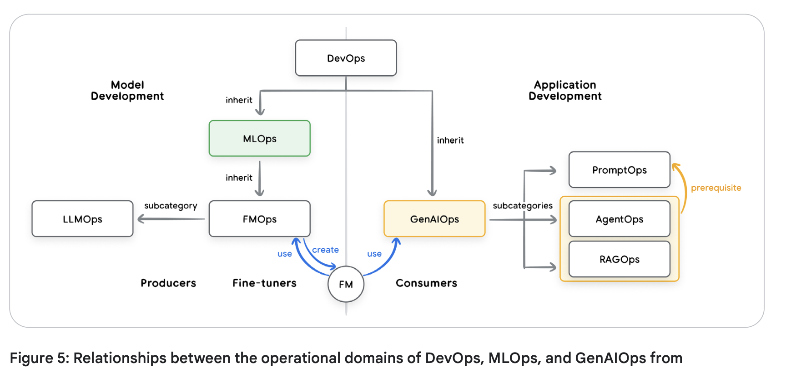{width=1000px}
*Source: https://medium.com/@sokratis.kartakis/genai-in-production-mlops-or-genaiops-25691c9becd0*

## Security and Governance: Hardening the Agentic Frontier

- The "Trust Trade-Off" dictates that as agents gain autonomy, risk increases

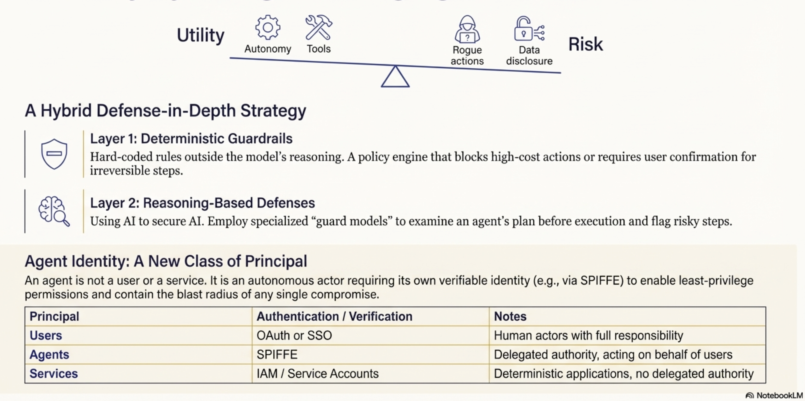{width=1000px}

### Hybrid Defense Strategy

- Deterministic Guardrails
  - Hardcoded policy engines (e.g., "deny all DELETE commands")
- Reasoning-Based Defenses:
  - Managed services like Model Armor to screen prompts and plans for injection attacks, jailbreaks, and PII (Personally Identifiable Information) leakage.

### Governing the Agent Fleet

- Control Plane:
- Preventing "Agent Sprawl" through a centralized gateway and registry for runtime policy enforcement and discovery.

{width=1000px}

## The Future: Self-Evolving Systems and Case Studies

- The final frontier; Learning Agent Loop
- Combine runtime artifacts (logs/traces) and human feedback to autonomously refine context engineering and tool usage.

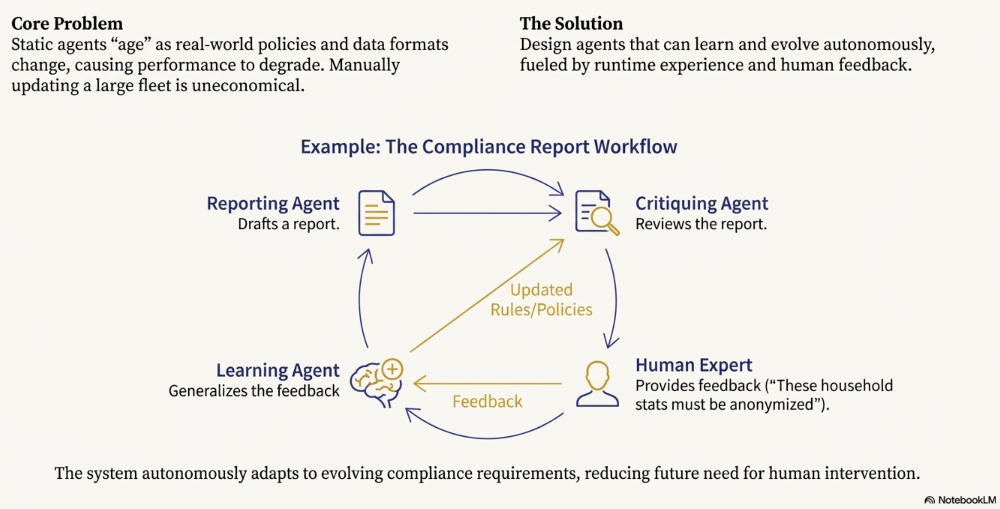{width=1000px}

### Agent Gym

- A standalone, offline simulation environment that is not in the execution path.
- It allows agents to "exercise" on synthetic data and pressure-test optimizations before production deployment.

### Advanced Case Studies

- Google Co-Scientist:
  - A multi-agent ecosystem where a "Supervisor" manages specialized agents to explore complex problem spaces, grounding scientific hypotheses in proprietary and public knowledge.
AlphaEvolve:
    An evolutionary agentic system that generates human-readable code. It has achieved breakthroughs in improving Google’s data center efficiency, optimizing chip design, and discovering faster matrix multiplication algorithms.
