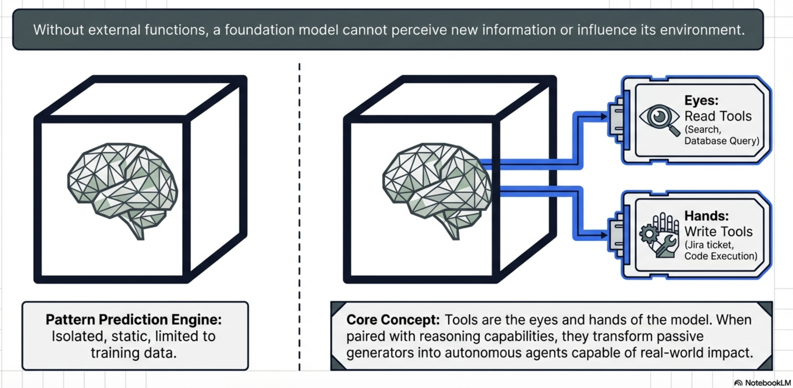
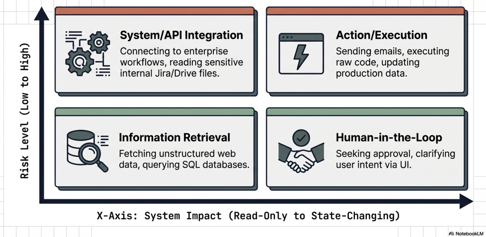
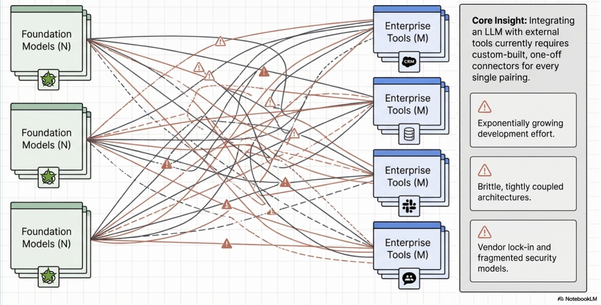
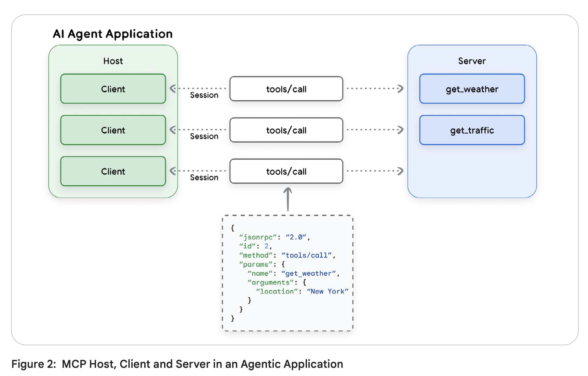
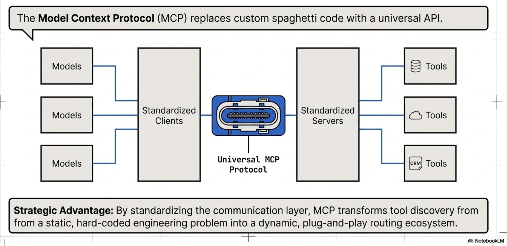

# AI Agent Interoperability and MCP

:::{objectives}

- Understand Agent interoperability:
  - Analyze the "N x M" integration challenge and how standardized communication layers facilitate ecosystem scaling
- Explore the Tool Taxonomy:
  - Master the functional contracts and design requirements for various tool categories
- MCP Security:
  - Identify unique agentic threat vectors and implement multi-layered enterprise defenses.
  - Key Definition: Agentic AI  An AI system that leverages a foundation model's reasoning capabilities to interact with users and achieve specific goals through the autonomous orchestration of external tools.

:::

## The Evolution from Models to Agents

{width=1000px}

- Foundation models were treated as isolated pattern prediction engines, restricted to the static data present at the time of their training
- LLMs pass high-level examinations or generate creative prose,
  - they remained "blind and paralyzed" regarding the real-time world
- Agentic AI represents the most significant shift in modern software architecture: moving from models that simply talk about the world to agents that act within it
- Tool-calling and integration to LLMs provide the "eyes and hands" necessary to perceive external environments and execute complex workflows

## Anatomy and Taxonomy of AI Tools

- A tool is a functional contract:
  - a strict declaration of parameters and purposes that allows a model to extend its capabilities
- Tools allow a model to either "know" (retrieve data) or "do" (execute an action)

### Anatomy of a tool

- Anatomy of a tool is essentially a defined **contract between the model and the tool itself**, similar to a **function in a traditional, non-AI program**
- Well-structured tool typically consists of the following core anatomical components:
  - The Name
  - The Description
  - Parameters (Input Schema)
  - Output Schema
  - Descriptive Error Messages

**Anatomical components:**

- The Name
  - a clear, unique identifier
  - Best practices: name should be highly descriptive and human-readable to help the model accurately decide which tool to select.
  - For example, a specific name like `create_critical_bug_in_jira_with_priority` is much more effective than a generic name like `update_jira`

- The Description
  - A natural language description
  - Should explain the tool's purpose and instructs the LLM on how and when it should be used
  - A robust description should:
    - Clearly explain the tool's inputs, outputs, and purpose without using obscure shorthand or technical jargon
    - Describe the *action* the agent needs to perform (what to do) rather than dictating the specific implementation (how to do it)
    - Include targeted examples to clarify ambiguities and show the model how to handle tricky requests

- Parameters (Input Schema)
  - Must define the expected input parameters, explicitly detailing their required data types and how the tool will use them.
  - To prevent confusing the model, parameter lists should be kept short with clearly named variables, and default values should be provided and documented whenever possible
  - In standardized protocols like the Model Context Protocol (MCP), this is formalized as an `inputSchema` that uses standard JSON schema formatting.

- Output Schema
  - Tools should define the structure of the data they return
  - Establishing a clear output schema (such as a JSON object) serves a dual purpose:
    - Allows the client application to validate the tool's results, and
    - Communicates to the LLM exactly what kind of data it should expect to receive and process
- Tools should be designed to return **concise output**
  - as large data tables or downloaded files can quickly overwhelm the LLM's context window, degrading performance and increasing costs

- Descriptive Error Messages
  - Often overlooked aspect
  - When a tool fails, it should return descriptive error messages back to the calling LLM rather than just raw error codes
  - These messages provide an additional channel to give the model instructions on how to failover or correct its next action
    - such as telling the model to "Ask the customer to confirm the product name" if a product ID lookup fails

{width=1000px}

:::{note}

**MCP-Specific Anatomy (Annotations):**

If the tool is built using the **Model Context Protocol (MCP)**, its JSON schema anatomy can also include an `annotations` field. Annotations provide the model with behavioral hints about the tool, such as:

- `destructiveHint`: Indicates the tool may perform destructive updates
- `readOnlyHint`: Indicates the tool does not modify its environment.
- `idempotentHint`: Indicates that calling the tool repeatedly with the same arguments will have no additional effect. 

*(Note: Because MCP servers may be untrusted, these annotations are considered hints and are not guaranteed to be strictly true).*
:::

### Good and bad tool documentation

:::{instructor-note} Coding

**Good documentation:**

```python
def get_product_information(product_id: str) -> dict:
    """
    Retrieves comprehensive information about a product based on the unique product ID.

    Args:
        product_id: The unique identifier for the product.
    Returns:
        A dictionary containing product details. Expected keys include:
        'product_name': The name of the product.
        'brand': The brand name of the product
        'description': A paragraph of text describing the product.
        'category': The category of the product.
        'status': The current status of the product (e.g., 'active','inactive', 'suspended').
    Example return value:
        {
        'product_name': 'Astro Zoom Kid's Trainers',
        'brand': 'Cymbal Athletic Shoes',
        'description': '...',
        'category': 'Children's Shoes',
        'status': 'active'
        }
    """
```

**Bad documentation:**

```python
def fetchpd(pid):
    """
    Retrieves product data
    Args:
        pid: id
    Returns:
        dict of data
    """
```

*Source: Agent Tools & Interoperability with MCP; Authors: Mike Styer, Kanchana Patlolla,Madhuranjan Mohan, and Sal Diaz*

:::

### Taxonomy of tools

Tool taxonomy is based on their primary functions and the types of interactions they facilitate.

**Four main categories:**

- Information Retrieval:
  - These tools allow agents to fetch data from a variety of sources, including web searches, databases, and unstructured documents. This category requires specific design considerations depending on the data type:
  - *Structured Data Retrieval:* Used for querying databases or spreadsheets (e.g., NL2SQL), which requires developers to define clear schemas and handle data types gracefully.
  - *Unstructured Data Retrieval:* Used for searching documents or knowledge bases (e.g., RAG), requiring robust search algorithms and clear retrieval instructions while managing context window limitations.
- Action / Execution:
  - These tools enable agents to perform real-world operations.
  - Examples include sending emails, posting messages, initiating code execution, or controlling physical devices.
- System / API Integration:
  - These tools allow agents to connect with existing software systems, integrate into enterprise workflows, or interact with third-party services. The source highlights specific use cases like:
  - *Google Connectors:* Interacting with Workspace apps like Gmail or Calendar, which requires handling authentication and API rate limits.
  - *Third-Party Connectors:* Integrating with external apps, which necessitates managing API keys securely and implementing error handling for the external calls.
- Human-in-the-Loop:
  - These tools are designed to facilitate collaboration with human users. They allow the agent to ask for clarification, seek human approval before taking critical actions, or hand off tasks that require human judgment.

{width=1000px}

## Engineering Best Practices for Tool Design

- LLM’s reasoning engine uses the tool documentation as the "instruction manual" for data processing
- Best practices for tool design are important for any reliable and effective agentic system
- Adhering to tool design best practices is important for
  - *Improving Dynamic Execution:*
    - Tools should be designed to represent granular, user-facing tasks rather than acting as thin wrappers over complex internal APIs
    - Human developers can navigate complex APIs, but an agent must decide at runtime which parameters to use.
    - If a tool captures a specific task, the agent is much more likely to call it correctly
  - *Driving Consistency:*
    - Making tools as granular as possible, limited to a single function with clear responsibilities, makes it easier for the agent to consistently determine when a tool is needed
    - Multi-tools (tools that take many steps in turn or encapsulate a long workflow) can be difficult for models to use reliably
  - *Protecting Performance and Cost:*
    - Poorly designed tools that return large volumes of data (like large tables or files) can quickly swamp an LLM's context window. Designing for concise output prevents context bloat, which can adversely affect the system's performance, cost, and ability to reason accurately
  - *Guiding the Agent's Reasoning:*
    - Best practices like implementing clear input/output schemas and providing descriptive error messages are essential for guiding the agent


### The Five Pillars of Tool Engineering

- Semantic Naming:
  - Use human-readable, specific names (e.g., create_critical_jira_bug) to help the planner select the correct tool without ambiguity.
- Parameter Simplification:
  - Keep parameter lists short.
  - Complex enterprise APIs with hundreds of parameters should be distilled into specialized tool signatures to prevent model confusion.
- Action-Oriented Descriptions:
  - Document  what  the tool does, not its internal implementation logic.
  - Describe the objective to allow the model scope for autonomous tool use.
- Granularity:
  - Keep tools focused on a single function.
  - Granular tools allow the agent to be more consistent in determining when the tool is needed.
  - Avoid "multi-tool" workflows that increase the probability of model hallucination or refusal.
- Output Conciseness:
  - Do not return massive datasets.
  - Return reference IDs or temporary database table names.
  - Large responses swamp the context window and poison the agent’s conversation history.
- Expert Tip:  Use  descriptive error messages  as a feedback loop. If a tool fails, return a message that guides the LLM on how to correct the call (e.g., "ID not found; ask the user for the product name and look up the ID again").

:::{instructor-note} Extended note
<details>
<summary>Tool Engineering best-practices</summary>

**1. Prioritize Thorough Documentation**
Because a tool's name, description, and attributes are passed directly to the model as part of its request context, they are vital for guiding the model's behavior.
*   **Use Clear Names:** Tool names should be descriptive, specific, and human-readable (e.g., `create_critical_bug_in_jira_with_priority` instead of `update_jira`) to help the model select the right tool and to create clearer audit logs.
*   **Clarify Descriptions:** Provide detailed descriptions of the tool's purpose without using shorthand or technical jargon. 
*   **Describe Parameters Explicitly:** Clearly detail all input and output parameters, their required types, and how the tool will use them. Keep parameter lists short and well-named.
*   **Provide Examples and Defaults:** Use targeted examples to clarify ambiguities and show the model how to handle complex requests. Additionally, provide and document default values for key parameters, which LLMs can often use correctly if guided.

**2. Describe Actions, Not Implementations**
The instructions provided to the model should focus on the overarching objective rather than dictating the use of specific tools.
*   **Focus on "What", Not "How":** Instruct the model on what it needs to achieve (e.g., "create a bug to describe the issue") rather than how to execute it (e.g., "use the create_bug tool"). 
*   **Avoid Redundancy and Rigid Workflows:** Do not repeat the tool's documentation in the system instructions, as this can confuse the model. Furthermore, avoid dictating a rigid sequence of actions; instead, allow the model scope to act autonomously.
*   **Explain Interactions:** If a tool has a side effect that impacts another tool (like saving a retrieved web page to a file), document this explicitly so the agent knows how to access the resulting data.

**3. Publish Tasks, Not API Calls**
Tools should be designed to encapsulate specific tasks an agent needs to perform, rather than acting as thin wrappers over existing internal APIs. While complex APIs are designed for humans who understand the full context of the available data, agents must decide dynamically which parameters to use. Defining a tool around a specific task greatly increases the likelihood that the agent will call it correctly.

**4. Make Tools as Granular as Possible**
Standard software coding practices apply to agent tools: they should be concise and limited to a single function.
*   **Define Clear Responsibilities:** Ensure each tool has a well-documented purpose, outlining exactly what it does, when it should be called, and what it returns.
*   **Avoid Multi-Tools:** Do not create tools that encompass long, multi-step workflows, as these are difficult to document and maintain, and LLMs struggle to use them consistently.

**5. Design for Concise Output**
Returning massive amounts of data—such as large tables, generated images, or downloaded files—can easily swamp an LLM's context window, degrading performance and increasing costs. Instead of returning large responses directly, tools should leverage external systems for data storage. For instance, a tool could insert a large query result into a temporary database table and simply return the table's name to the LLM.

**6. Use Validation Effectively**
Implement input and output schema validation wherever possible. Clearly defined schemas serve as runtime checks for the application while acting as additional documentation that helps the LLM understand how to formulate requests and interpret results.

**7. Provide Descriptive Error Messages**
When a tool fails, returning a simple error code is a missed opportunity. Because the tool's error message is returned to the calling LLM, it should be used as an instructional channel. A descriptive error message should explicitly tell the LLM how to failover or correct its next action, such as instructing the model to ask the user to clarify a product name if a product ID lookup fails.

</details>
:::


## MCP - Model Context Protocol

- The AI industry is currently struggling with fragmentation
- Every new model (N) and every new tool (M) requires a custom connector,
  - leading to an "N x M" integration explosion.



### The "N x M" Problem and the MCP Solution

- MCP solves "N x M" Problem by providing a universal interface, functioning for AI agents exactly as the Language Server Protocol (LSP) does for IDEs.


*Source: Agent Tools & Interoperability with MCP; Authors: Mike Styer, Kanchana Patlolla,Madhuranjan Mohan, and Sal Diaz*

**Core Architectural Components:**

- MCP Host:
  - The orchestrator (e.g., a multi-agent system) that manages clients and enforces security policies.
- MCP Client:
  - The embedded component within the host that maintains the session lifecycle.
- MCP Server:
  - The adapter that advertises tools, executes commands, and proxies for external APIs.

**The Technical Stack:**

- MCP is built on  JSON-RPC 2.0; It leverages two primary transport mechanisms:
- stdio:
  - For local communication where the server runs as a subprocess (e.g., local filesystem access).
- Streamable HTTP:
  - The standard for remote connections.

:::{note}

MCP deprecated the legacy `HTTP+SSE` transport in favor of `Streamable HTTP` to better support stateless server architectures, which are essential for horizontal scaling in enterprise environments.



:::
