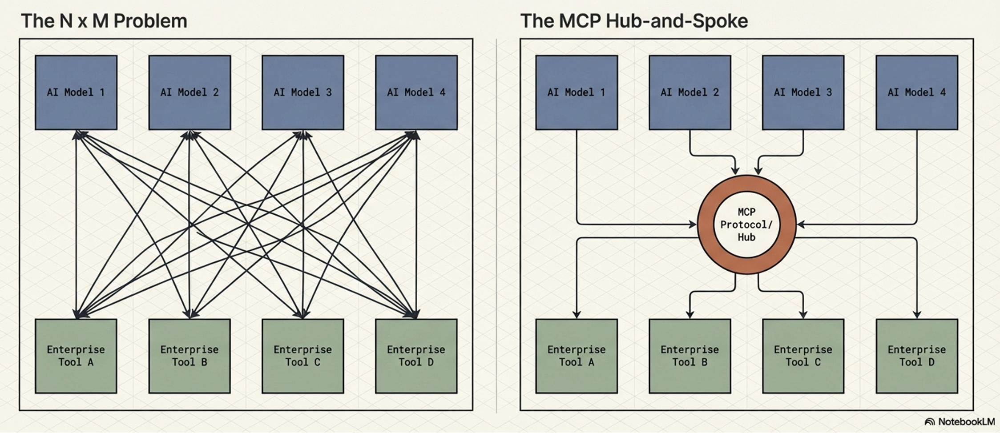
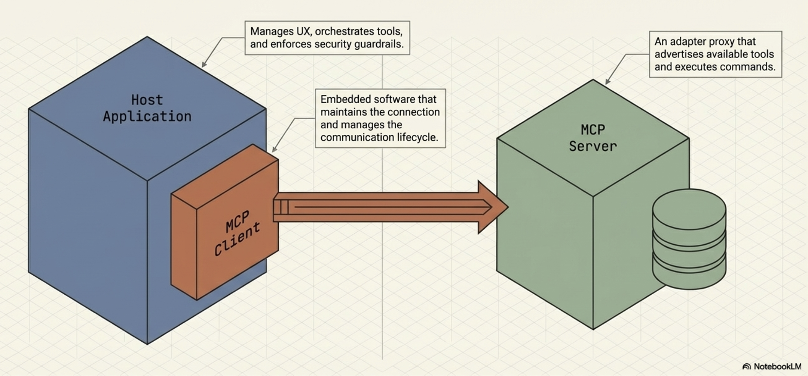
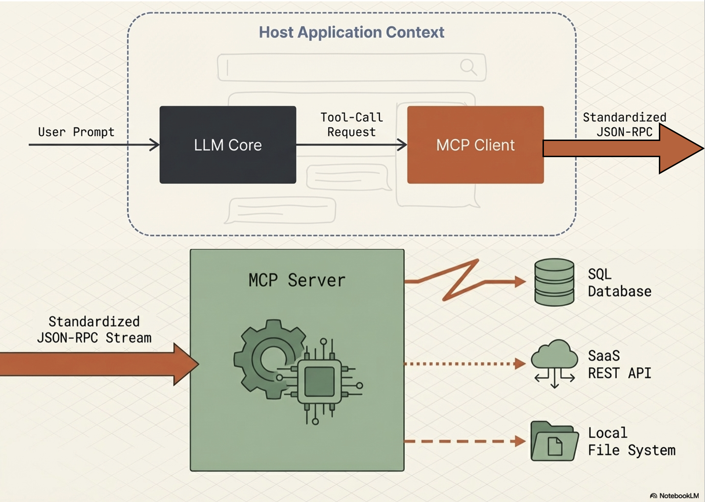
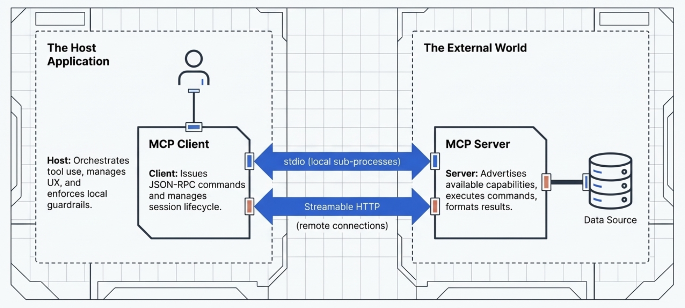
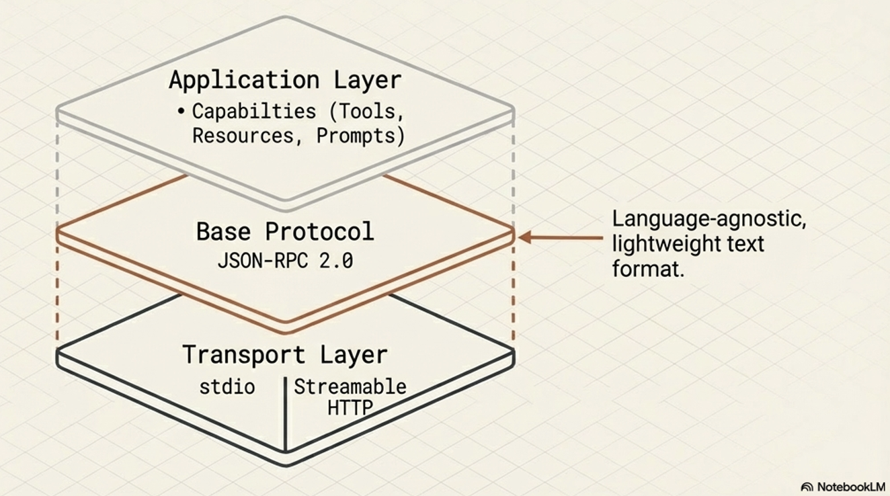
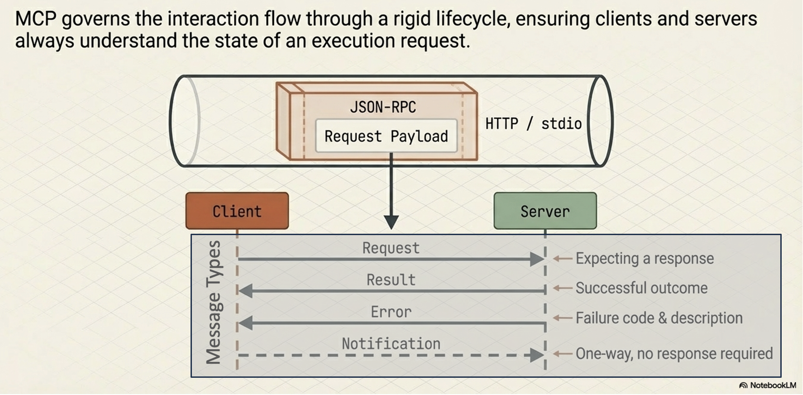
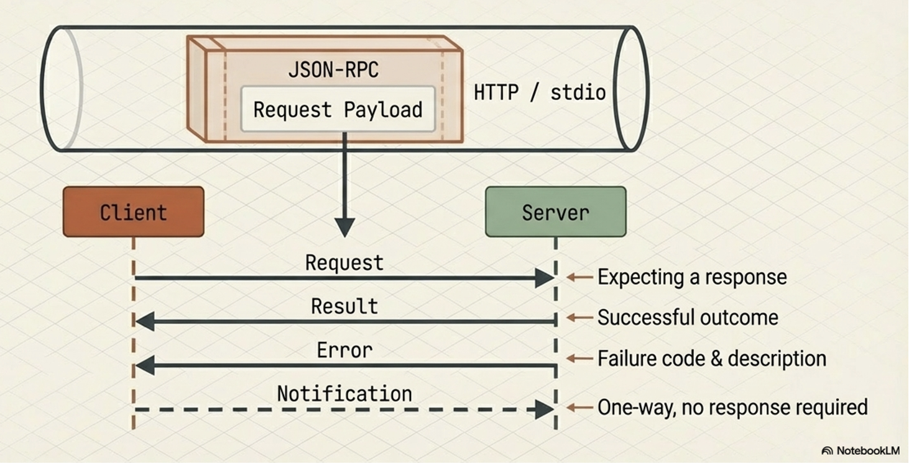
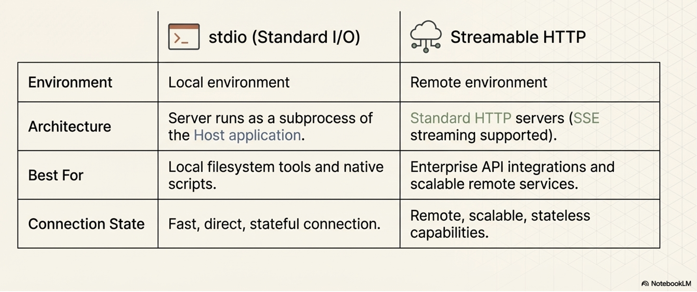
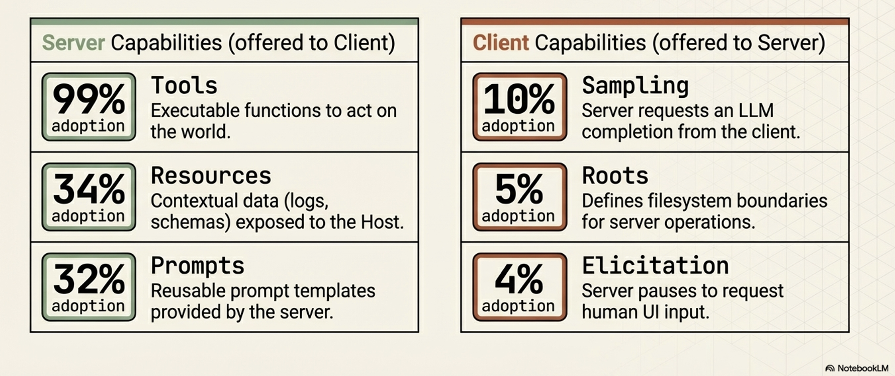

# AI Agent Interoperability and MCP

:::{objectives}

- Understand Agent interoperability:
  - Analyze the "N x M" integration challenge and how standardized communication layers facilitate ecosystem scaling
- Explore the Tool Taxonomy:
  - Master the functional contracts and design requirements for various tool categories
- MCP Security:
  - Identify unique agentic threat vectors and implement multi-layered enterprise defenses.
  - Key Definition: Agentic AI  An AI system that leverages a foundation model's reasoning capabilities to interact with users and achieve specific goals through the autonomous orchestration of external tools.

:::

## The Evolution from Models to Agents

{width=1000px}

- Foundation models were treated as isolated pattern prediction engines, restricted to the static data present at the time of their training
- LLMs pass high-level examinations or generate creative prose,
  - they remained "blind and paralyzed" regarding the real-time world
- Agentic AI represents the most significant shift in modern software architecture: moving from models that simply talk about the world to agents that act within it
- Tool-calling and integration to LLMs provide the "eyes and hands" necessary to perceive external environments and execute complex workflows

## Anatomy and Taxonomy of AI Tools

- A tool is a functional contract:
  - a strict declaration of parameters and purposes that allows a model to extend its capabilities
- Tools allow a model to either "know" (retrieve data) or "do" (execute an action)

### Anatomy of a tool

- Anatomy of a tool is essentially a defined **contract between the model and the tool itself**, similar to a **function in a traditional, non-AI program**
- Well-structured tool typically consists of the following core anatomical components:
  - The Name
  - The Description
  - Parameters (Input Schema)
  - Output Schema
  - Descriptive Error Messages

**Anatomical components:**

- The Name
  - a clear, unique identifier
  - Best practices: name should be highly descriptive and human-readable to help the model accurately decide which tool to select.
  - For example, a specific name like `create_critical_bug_in_jira_with_priority` is much more effective than a generic name like `update_jira`

- The Description
  - A natural language description
  - Should explain the tool's purpose and instructs the LLM on how and when it should be used
  - A robust description should:
    - Clearly explain the tool's inputs, outputs, and purpose without using obscure shorthand or technical jargon
    - Describe the *action* the agent needs to perform (what to do) rather than dictating the specific implementation (how to do it)
    - Include targeted examples to clarify ambiguities and show the model how to handle tricky requests

- Parameters (Input Schema)
  - Must define the expected input parameters, explicitly detailing their required data types and how the tool will use them.
  - To prevent confusing the model, parameter lists should be kept short with clearly named variables, and default values should be provided and documented whenever possible
  - In standardized protocols like the Model Context Protocol (MCP), this is formalized as an `inputSchema` that uses standard JSON schema formatting.

- Output Schema
  - Tools should define the structure of the data they return
  - Establishing a clear output schema (such as a JSON object) serves a dual purpose:
    - Allows the client application to validate the tool's results, and
    - Communicates to the LLM exactly what kind of data it should expect to receive and process
- Tools should be designed to return **concise output**
  - as large data tables or downloaded files can quickly overwhelm the LLM's context window, degrading performance and increasing costs

- Descriptive Error Messages
  - Often overlooked aspect
  - When a tool fails, it should return descriptive error messages back to the calling LLM rather than just raw error codes
  - These messages provide an additional channel to give the model instructions on how to failover or correct its next action
    - such as telling the model to "Ask the customer to confirm the product name" if a product ID lookup fails

{width=1000px}

:::{note}

**MCP-Specific Anatomy (Annotations):**

If the tool is built using the **Model Context Protocol (MCP)**, its JSON schema anatomy can also include an `annotations` field. Annotations provide the model with behavioral hints about the tool, such as:

- `destructiveHint`: Indicates the tool may perform destructive updates
- `readOnlyHint`: Indicates the tool does not modify its environment.
- `idempotentHint`: Indicates that calling the tool repeatedly with the same arguments will have no additional effect. 

*(Note: Because MCP servers may be untrusted, these annotations are considered hints and are not guaranteed to be strictly true).*
:::

### Good and bad tool documentation

:::{instructor-note} Coding

**Good documentation:**

```python
def get_product_information(product_id: str) -> dict:
    """
    Retrieves comprehensive information about a product based on the unique product ID.

    Args:
        product_id: The unique identifier for the product.
    Returns:
        A dictionary containing product details. Expected keys include:
        'product_name': The name of the product.
        'brand': The brand name of the product
        'description': A paragraph of text describing the product.
        'category': The category of the product.
        'status': The current status of the product (e.g., 'active','inactive', 'suspended').
    Example return value:
        {
        'product_name': 'Astro Zoom Kid's Trainers',
        'brand': 'Cymbal Athletic Shoes',
        'description': '...',
        'category': 'Children's Shoes',
        'status': 'active'
        }
    """
```

**Bad documentation:**

```python
def fetchpd(pid):
    """
    Retrieves product data
    Args:
        pid: id
    Returns:
        dict of data
    """
```

*Source: Agent Tools & Interoperability with MCP; Authors: Mike Styer, Kanchana Patlolla,Madhuranjan Mohan, and Sal Diaz*

:::

### Taxonomy of tools

Tool taxonomy is based on their primary functions and the types of interactions they facilitate.

**Four main categories:**

- Information Retrieval:
  - These tools allow agents to fetch data from a variety of sources, including web searches, databases, and unstructured documents. This category requires specific design considerations depending on the data type:
  - *Structured Data Retrieval:* Used for querying databases or spreadsheets (e.g., NL2SQL), which requires developers to define clear schemas and handle data types gracefully.
  - *Unstructured Data Retrieval:* Used for searching documents or knowledge bases (e.g., RAG), requiring robust search algorithms and clear retrieval instructions while managing context window limitations.
- Action / Execution:
  - These tools enable agents to perform real-world operations.
  - Examples include sending emails, posting messages, initiating code execution, or controlling physical devices.
- System / API Integration:
  - These tools allow agents to connect with existing software systems, integrate into enterprise workflows, or interact with third-party services. The source highlights specific use cases like:
  - *Google Connectors:* Interacting with Workspace apps like Gmail or Calendar, which requires handling authentication and API rate limits.
  - *Third-Party Connectors:* Integrating with external apps, which necessitates managing API keys securely and implementing error handling for the external calls.
- Human-in-the-Loop:
  - These tools are designed to facilitate collaboration with human users. They allow the agent to ask for clarification, seek human approval before taking critical actions, or hand off tasks that require human judgment.

{width=1000px}

## Engineering Best Practices for Tool Design

- LLM’s reasoning engine uses the tool documentation as the "instruction manual" for data processing
- Best practices for tool design are important for any reliable and effective agentic system
- Adhering to tool design best practices is important for
  - *Improving Dynamic Execution:*
    - Tools should be designed to represent granular, user-facing tasks rather than acting as thin wrappers over complex internal APIs
    - Human developers can navigate complex APIs, but an agent must decide at runtime which parameters to use.
    - If a tool captures a specific task, the agent is much more likely to call it correctly
  - *Driving Consistency:*
    - Making tools as granular as possible, limited to a single function with clear responsibilities, makes it easier for the agent to consistently determine when a tool is needed
    - Multi-tools (tools that take many steps in turn or encapsulate a long workflow) can be difficult for models to use reliably
  - *Protecting Performance and Cost:*
    - Poorly designed tools that return large volumes of data (like large tables or files) can quickly swamp an LLM's context window. Designing for concise output prevents context bloat, which can adversely affect the system's performance, cost, and ability to reason accurately
  - *Guiding the Agent's Reasoning:*
    - Best practices like implementing clear input/output schemas and providing descriptive error messages are essential for guiding the agent


### The Five Pillars of Tool Engineering

- Semantic Naming:
  - Use human-readable, specific names (e.g., create_critical_jira_bug) to help the planner select the correct tool without ambiguity.
- Parameter Simplification:
  - Keep parameter lists short.
  - Complex enterprise APIs with hundreds of parameters should be distilled into specialized tool signatures to prevent model confusion.
- Action-Oriented Descriptions:
  - Document  what  the tool does, not its internal implementation logic.
  - Describe the objective to allow the model scope for autonomous tool use.
- Granularity:
  - Keep tools focused on a single function.
  - Granular tools allow the agent to be more consistent in determining when the tool is needed.
  - Avoid "multi-tool" workflows that increase the probability of model hallucination or refusal.
- Output Conciseness:
  - Do not return massive datasets.
  - Return reference IDs or temporary database table names.
  - Large responses swamp the context window and poison the agent’s conversation history.
- Expert Tip:  Use  descriptive error messages  as a feedback loop. If a tool fails, return a message that guides the LLM on how to correct the call (e.g., "ID not found; ask the user for the product name and look up the ID again").

:::{instructor-note} Extended note
<details>
<summary>Tool Engineering best-practices</summary>

**1. Prioritize Thorough Documentation**
Because a tool's name, description, and attributes are passed directly to the model as part of its request context, they are vital for guiding the model's behavior.
*   **Use Clear Names:** Tool names should be descriptive, specific, and human-readable (e.g., `create_critical_bug_in_jira_with_priority` instead of `update_jira`) to help the model select the right tool and to create clearer audit logs.
*   **Clarify Descriptions:** Provide detailed descriptions of the tool's purpose without using shorthand or technical jargon. 
*   **Describe Parameters Explicitly:** Clearly detail all input and output parameters, their required types, and how the tool will use them. Keep parameter lists short and well-named.
*   **Provide Examples and Defaults:** Use targeted examples to clarify ambiguities and show the model how to handle complex requests. Additionally, provide and document default values for key parameters, which LLMs can often use correctly if guided.

**2. Describe Actions, Not Implementations**
The instructions provided to the model should focus on the overarching objective rather than dictating the use of specific tools.
*   **Focus on "What", Not "How":** Instruct the model on what it needs to achieve (e.g., "create a bug to describe the issue") rather than how to execute it (e.g., "use the create_bug tool"). 
*   **Avoid Redundancy and Rigid Workflows:** Do not repeat the tool's documentation in the system instructions, as this can confuse the model. Furthermore, avoid dictating a rigid sequence of actions; instead, allow the model scope to act autonomously.
*   **Explain Interactions:** If a tool has a side effect that impacts another tool (like saving a retrieved web page to a file), document this explicitly so the agent knows how to access the resulting data.

**3. Publish Tasks, Not API Calls**
Tools should be designed to encapsulate specific tasks an agent needs to perform, rather than acting as thin wrappers over existing internal APIs. While complex APIs are designed for humans who understand the full context of the available data, agents must decide dynamically which parameters to use. Defining a tool around a specific task greatly increases the likelihood that the agent will call it correctly.

**4. Make Tools as Granular as Possible**
Standard software coding practices apply to agent tools: they should be concise and limited to a single function.
*   **Define Clear Responsibilities:** Ensure each tool has a well-documented purpose, outlining exactly what it does, when it should be called, and what it returns.
*   **Avoid Multi-Tools:** Do not create tools that encompass long, multi-step workflows, as these are difficult to document and maintain, and LLMs struggle to use them consistently.

**5. Design for Concise Output**
Returning massive amounts of data—such as large tables, generated images, or downloaded files—can easily swamp an LLM's context window, degrading performance and increasing costs. Instead of returning large responses directly, tools should leverage external systems for data storage. For instance, a tool could insert a large query result into a temporary database table and simply return the table's name to the LLM.

**6. Use Validation Effectively**
Implement input and output schema validation wherever possible. Clearly defined schemas serve as runtime checks for the application while acting as additional documentation that helps the LLM understand how to formulate requests and interpret results.

**7. Provide Descriptive Error Messages**
When a tool fails, returning a simple error code is a missed opportunity. Because the tool's error message is returned to the calling LLM, it should be used as an instructional channel. A descriptive error message should explicitly tell the LLM how to failover or correct its next action, such as instructing the model to ask the user to clarify a product name if a product ID lookup fails.

</details>
:::


## MCP - Model Context Protocol

- The AI industry is currently struggling with fragmentation
- Every new model (N) and every new tool (M) requires a custom connector,
  - leading to an "N x M" integration explosion.


### The "N x M" Problem and the MCP Solution

- MCP solves "N x M" Problem by providing a universal interface, functioning for AI agents exactly as the Language Server Protocol (LSP) does for IDEs.



:::{instructor-note} Additional figure
<details>
<summary>MCP in an AI application</summary>


*Source: Agent Tools & Interoperability with MCP; Authors: Mike Styer, Kanchana Patlolla,Madhuranjan Mohan, and Sal Diaz*

</details>
:::

### Core Components of MCP

:::{exercise} MCP - Architectural Components

- MCP design separates the AI application from its tool integrations,
  - creating a modular and extensible approach to AI apps and tool development
- Allows modular development
  - AI agent developers - focus on core competencies like reasoning and user experience,
  - AI tool and third-party developers - build specialized servers for any tool or API
- Core architectural components
  - MCP Host (AI application)
  - MCP Server (adapter or a proxy for an external tool, data source, or API)
  - MCP Client (maintains the active connection with the Server)

**High-level overview:**



**How components are connected?**

:::

### MCP Host

- MCP Host is the AI application:
  - MCP Host pperate as a standalone application or as a sub-component within a larger multi-agent system
- Responsible for
  - orchestrating the use of tools,
  - user experience, and
  - enforcing security policies and content guardrails
- MCP Host creates and manages individual MCP clients

### MCP Server

- Functions as an adapter or a proxy for an external tool, data source, or API
- Provides a specific set of capabilities that a developer wants to make available to AI applications
- Main responsibilities:
  - Advertising its available tools (tool discovery),
  - receiving and executing commands from the Client, and
  - formatting and returning the results
- In enterprise contexts, the Server is also tasked with handling security, scalability, and governance

### MCP Client

- The embedded component within the host that maintains the active connection with the Server
- Dose not interact with user or reason with LLM
- Responsible for (strictly handel)
  - issuing commands,
  - receiving responses, and
  - managing the lifecycle of the communication session with its designated MCP Server



## MCP - The Technical Stack

- MCP is built upon a standardized communication layer to ensure consistency and interoperability between clients and servers.

:::{exercise} MCP - Tech-stack

This stack consists of three primary components:

- Base Protocol
- Message Types
- Transport Mechanisms

**Tech-stack:**


:::

### Base Protocol

MCP uses **JSON-RPC 2.0** as its foundational message format. This gives the protocol a structure that is lightweight, text-based, and completely language-agnostic for all its communications.



### Message Types

The interaction flow within MCP is governed by four fundamental types of messages:

- Requests:
  - Remote Procedure Calls (RPC) sent from one party to the other that expect a response.
- Results:
  - Messages that contain the successful outcome of a corresponding request.
- Errors:
  - Messages that indicate a request failed, which include both an error code and a description.
- Notifications:
  - One-way messages that do not require a response and cannot be replied to.



### Transport Mechanisms

To ensure that the client and server can interpret each other's messages, MCP relies on standard transport protocols. It supports two primary transport mechanisms depending on the deployment environment:

- Stdio (Standard Input/Output):
  - This is utilized for fast and direct local communication, specifically when the MCP server runs as a subprocess of the Host application. It is typically used when tools need to access local resources, such as the user's filesystem.
- Streamable HTTP:
  - This is the recommended protocol for remote client-server connections. While it supports Server-Sent Events (SSE) for streaming responses, it also allows for stateless servers and can be implemented in a plain HTTP server without strictly requiring SSE.



### MCP Primitives

- Key concepts or capabilities defined by the MCP specification
- Enable LLM-based applications to interact with external systems.
- Divided into two categories based on which component provides the capability:
- Systematically break down the barriers between isolated AI reasoning engines and the real world

**Server-Side:**

- Capabilities offered by Server to Client
- Tools: A standardized way for a server to describe functions it makes available to clients (e.g., `read_file`, `get_weather`, `execute_sql`). Tools are the core driver of MCP's value and are currently the most widely supported primitive.
- Resources: Contextual data that the server makes available for the host application to use, such as database records, file contents, log files, or images.
- Prompts: Reusable prompt templates or examples provided by the server to help clients understand how to best interact with its specific tools and resources.

**Client-Side Capabilities:**

- Capabilities offered by Client to Server
- Sampling:
  - This reverses the typical flow of control by allowing an MCP server to request an LLM completion (a "thought" or summarization) from the client.
- Elicitation:
  - Allows an MCP server to pause its operation and request additional information directly from the human user via the client's user interface.
- Roots:
  - Defines specific boundaries (currently restricted to `file:` URIs) that dictate where a server is permitted to operate within a filesystem.



*Note on Adoption:* While all these primitives are defined in the protocol, **Tools** are currently supported by roughly 99% of clients and drive the primary value of MCP. The other primitives (like Sampling, Roots, and Elicitation) have significantly lower adoption (under 10%), so their long-term importance in production environments is still emerging.

### Strategic Advantages and Performance Trade-offs

- Accelerating Development and a Reusable Ecosystem
  - MCP significantly simplifies the development process bue to the common, standardized protocol for tool integration
  - plug-and-play" ecosystem where tools become easily shareable and reusable assets, supported by centralized directories like the MCP Registry
- Dynamically Enhancing Agent Capabilities and Autonomy
  - Instead of relying on hard-coded tools, MCP-enabled applications can discover available tools at runtime, which grants agents greater adaptability and autonomy
- Architectural Flexibility and Future-Proofing
  - MCP decouples an AI agent's core reasoning architecture from the specific implementation details of the tools it uses.
  - Logic, memory, and tools are treated as independent components/modules
  - This modularity makes systems much easier to debug, scale, and maintain, allowing organizations to easily swap out underlying LLM providers or backend services without needing to re-architect their integration layer
  
The Model Context Protocol (MCP) presents a powerful new paradigm for connecting AI agents to external tools, but it comes with a distinct set of tradeoffs. While it offers significant strategic advantages for development and architecture, it also introduces critical challenges regarding performance, enterprise readiness, and security.

Here is a breakdown of the tradeoffs of using MCPs:

### The Advantages (What MCP Gets Right)
*   **Accelerates Development:** MCP addresses the "N x M" integration problem by providing a universal, standardized protocol, replacing the need to build custom connectors for every model and tool pairing. This fosters a reusable "plug-and-play" ecosystem.
*   **Dynamic Autonomy:** Instead of hard-coding tools, MCP allows agents to discover available tools dynamically at runtime, dramatically expanding the capabilities and information available to the LLM.
*   **Architectural Flexibility:** By decoupling the agent's core reasoning engine from the tools' implementation, MCP enables highly modular systems. This makes it easier to swap out models or backend services without needing to rebuild the entire integration layer.

### The Disadvantages and Challenges (The Risks of MCP)

**Performance and Scalability Issues:**

- Context Window Bloat:
  - To know what tools are available, the agent must load all tool definitions and schemas from connected MCP servers into its context window.
  - This can consume a massive amount of tokens, leading to increased costs, higher latency, and the loss of other critical context.
- Degraded Reasoning:
  - Loading too many tool definitions can overwhelm the model, causing it to ignore useful tools, invoke irrelevant ones, or lose track of the user's original intent
- Stateful Complexity:
  - Using stateful, persistent connections for remote servers can complicate the system architecture, making horizontal scaling and load balancing much harder than with stateless REST APIs.

**Enterprise Readiness Gaps:**

- Authentication and Identity:
  - The base MCP specification lacks robust, enterprise-ready standards for fine-grained authentication and authorization.
  - Furthermore, it struggles with identity management, making it ambiguous whether an action is initiated by the end-user, the AI agent, or a generic system account, which complicates auditing.
- Lack of Native Observability:
  - The protocol does not natively define standards for logging, tracing, or metrics, 
  - These are essential for debugging and threat detection in production systems

**New Security Vulnerabilities:**

- Dynamic Capability Injection:
  - Because MCP servers can change the tools they offer without explicit client notification, an agent could unexpectedly inherit dangerous capabilities (e.g., a "read-only" agent suddenly gaining the ability to execute financial transactions).
-Tool Shadowing:
  A malicious tool can be created with a description or trigger very similar to a legitimate tool. If the LLM gets confused and chooses the malicious "shadow" tool, it could hand over sensitive data to an attacker.
- Confused Deputy Problem:
  - Because the MCP server acts as a highly privileged intermediary, a malicious user could use prompt injection to trick the AI into ordering the MCP server to misuse its privileges (e.g., exfiltrating a secure code repository).
- Coarse Access Controls:
  - The protocol only supports coarse-grained client-server authorization. It lacks support for limiting access on a per-tool or per-resource basis, making it difficult to enforce the principle of least privilege.

