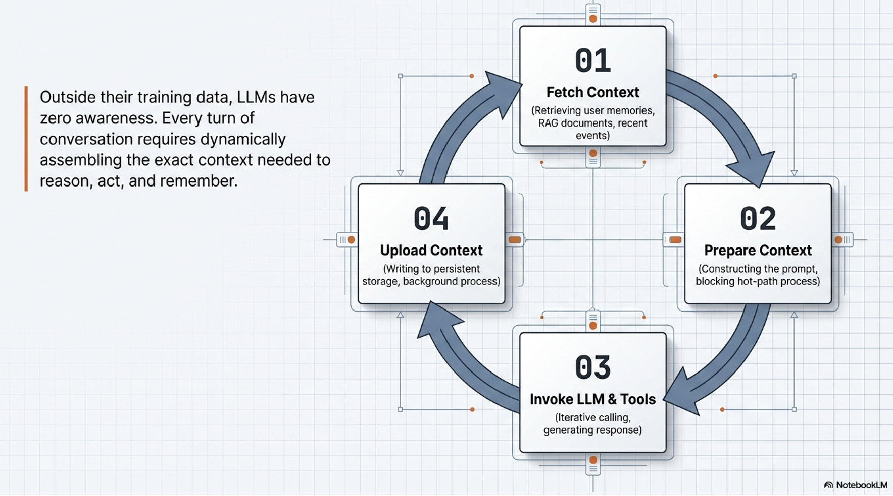
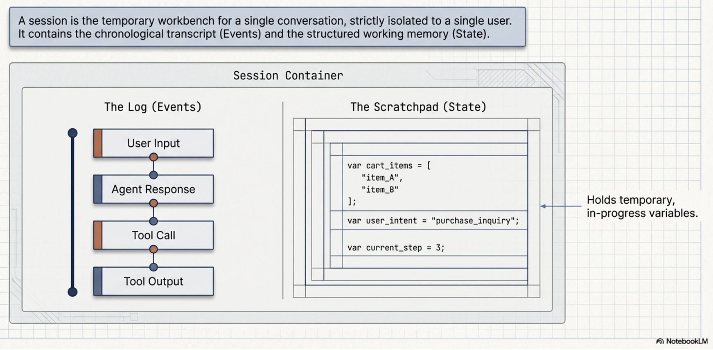
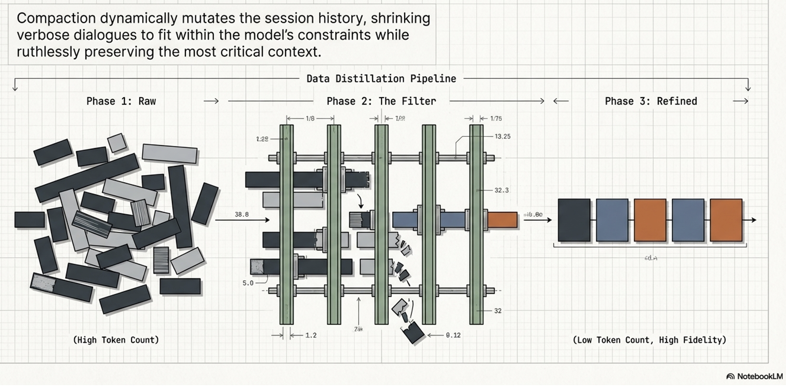
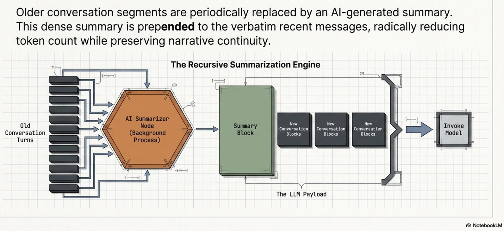
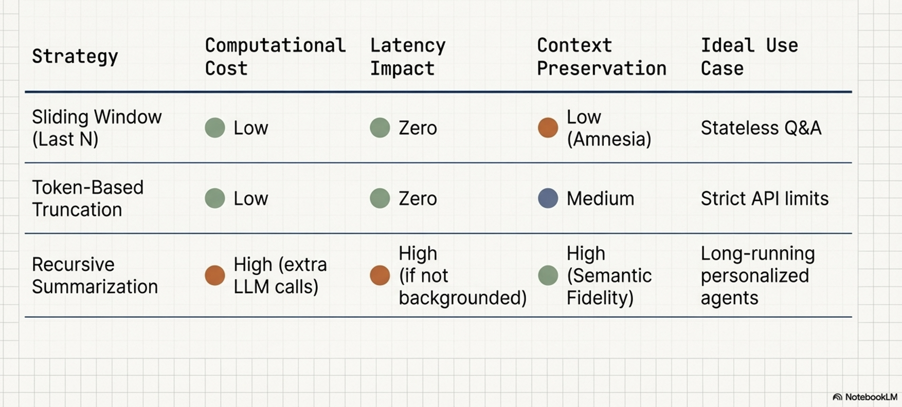
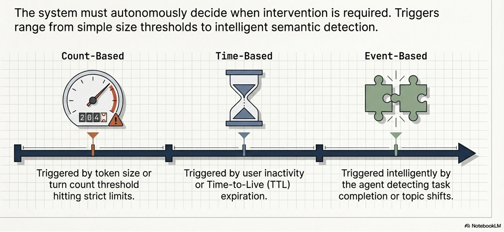
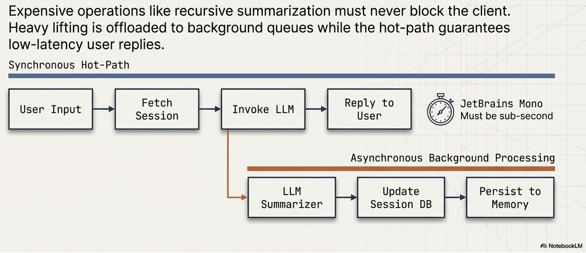
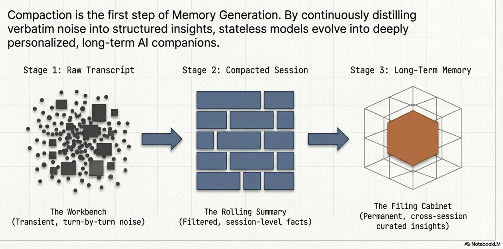

# Context Engineering for Stateful AI Agents

:::{objectives}

:::

## Why LLMs need context engineering?

- LLMs are inherently stateless
  - Possess no awareness of previous interactions unless that data is explicitly provided in each request.
- By engineering the context, we transform stateless models into state-aware, intelligent agents capable of personalized reasoning and long-term continuity.
- In agentic workflows, dynamic context assembly acts as the  "mise en place" —the culinary discipline of gathering and preparing all high-quality ingredients and tools before execution begins. Moving from static prompts to dynamic payloads is critical for performance:

## Fundamentals of Context Engineering

- Context Engineering represents a strategic evolution from traditional Prompt Engineering.
- Prompt engineering focuses on crafting static instructions, while Context Engineering is the architectural process of dynamically assembling and managing the entire information payload within an LLM’s context window.



### Importance of Context Engineering

- Tailored Payloads:
  - Ensures the model receives exactly the information required for a specific task, reducing noise and token waste.
- Performance Optimization:
  - Strategic selection of data minimizes quality degradation caused by information density and attention drift.
- Operational Orchestration:
  - Shifts the burden from hardcoded strings to dynamic systems (RAG, session stores, memory managers) that feed the agent relevant data in real-time.To manage this complexity, context is categorized into three functional tiers:
- Context to Guide Reasoning:
  - Defines the agent’s fundamental patterns. Includes  system instructions  (persona),  tool definitions  (API schemas), and  few-shot examples  (in-context learning).
- Evidential & Factual Data:
  - The substantive data the agent reasons over. Includes  long-term memory ,  external knowledge  (RAG),  tool/sub-agent outputs , and  Artifacts  (non-textual data like images or files associated with the session).
- Immediate Conversational Information:
  - Grounds the agent in the present task. Encompasses  conversation history ,  user prompts , and the  scratchpad/state  for temporary calculations.This flow of information is orchestrated through the primary chronological container of interaction: the Session.

### key components of context engineering

- Sessions: Managing the Immediate Dialogue State
- Context Compaction and History Management
- Memory Architecture: The Engine of Long-Term Persistence

## Sessions: Managing the Immediate Dialogue State

- Session serves as the container for a single, continuous conversation
- Strategically, it acts as the agent's temporary  "workbench,"
  - Hold the immediate tools, notes, and reference materials required for active reasoning
  - User may have multiple sessions, each remains a distinct, disconnected record to ensure focus
- The atomic building blocks of a Session consist of *Events* and *State*
- Events:
  - User Inputs:  Messages from the user in various formats (text, audio, image).
  - Agent Responses:  The replies generated by the model.
  - Tool Calls:  The agent’s decision to trigger an external API or function.
  - Tool Outputs:  The data returned from those external calls used to continue reasoning.
- States:
  - The implementation of these components varies significantly by framework, influencing how state is persisted:

| Feature | ADK (Application Development Kit) | LangGraph |
| ------ | ------ | ------ |
| Architecture | Uses explicit  Session  and  Event  objects. | Uses  State-as-Session . |
| Storage Model | Decoupled; history and state are distinct folders. | An all-encompassing, mutable state object. |
| History Mutation | Generally an append-only log of events. | Mutable; state is transformed or compacted directly. |
| Persistence | Decoupled from the model; saved to Agent Engine. | Managed through graph logic and internal state persistence. |



Technical Note:  Architects must be wary of "Framework Isolation." Session storage often couples the database schema to the framework’s internal objects (e.g., ADK Events vs. LangGraph Messages), making conversation records non-portable. To achieve true interoperability in multi-agent systems, developers should utilize a  decoupled Memory layer  that stores processed, canonical information rather than raw framework-specific objects.

## Context Compaction and History Management

- The challenge of managing a session’s growth is best described by the  "Suitcase Analogy."
  - Overpacking the context window leads to high API costs, increased latency, and model confusion.
  - Conversely, packing too little causes the agent to lose essential context.
  - Success depends on carrying only what is necessary for the current "trip.
- As token counts increase, performance often degrades due to  noise in context
  - Developers employ compaction strategies to mitigate this issue



### Primary context compaction strategies

- Last N Turns:
  - A simple sliding window that keeps only recent interactions;
  - Efficient but risks losing "passport-level" critical info from the start.
- Token-Based Truncation:
  - Fills the window up to a predefined limit by working backward from the most recent message.
- Recursive Summarization:
  - Uses an LLM to condense older dialogue into a summary prefixed to verbatim messages.
  - This maintains density but adds LLM overhead.
- Event-Based Triggers:
  - Triggers compaction only upon semantic task completion or topic shifts, ensuring logical continuity.
  - Production systems use programmatic configurations to trigger these background processes without blocking the user:


:::{instructor-note} Visual explanation

**Last N Turns vs Token-Based Truncation:**


**Recursive Summarization:**


**Comparison:**


**Trigger engines:**


**Production architecture:**


**Evolution of the context:**

:::

:::{instructor-note} Coding

```python
# Example of background summarization configuration
from google.adk.apps import App
from google.adk.apps.app import EventsCompactionConfig


app = App(
    name='stateful_agent_app',
    root_agent=agent,
    # Trigger summarization every 5 turns, keeping 1 turn of overlap
    events_compaction_config=EventsCompactionConfig(
        compaction_interval=5,
        overlap_size=1,
    ),
)
```

:::

## Memory Architecture: The Engine of Long-Term Persistence

- Memory captures meaningful insights that transcend individual sessions.
- It is the foundation for personalization and multi-agent interoperability.
- Crucially, memory can solve the  "Cold-Start" problem  by utilizing  Bootstrapped Data —pre-loading memories from internal systems like a CRM to provide a personalized experience even in a first-time interaction.
- To distinguish Memory from other patterns, consider the  Librarian (RAG)  vs.  Personal Assistant (Memory) :

| Feature | RAG (The Librarian) | Memory (The Assistant) |
| ------ | ------ | ------ |
| Primary Goal | Inject global facts/external knowledge. | Create personalized, stateful experiences. |
| Data Source | Static knowledge bases (PDFs, Wikis). | User dialogue and behavioral observations. |
| Isolation | Generally shared across all users. | Strictly isolated; scoped per-user. |
| Read/Write | Batch processed; retrieved as a tool. | Event-based; extracted from active sessions. |

### Categories of "Memory"

**Memory is categorized by function:**

- Declarative Memory ("Knowing What"):
  - Explicit facts and events (e.g., "The user has a peanut allergy").
- Procedural Memory ("Knowing How"):
  - Knowledge of workflows and skills.
  - Procedural memories act as a  reasoning "playbook."
  - Procedural Memory provides Fast, dynamic Adaptation by guiding the agent via in-context learning
    - Unlike  Fine-Tuning/RLHF , which is a slow, offline adaptation of model weights

## The Memory Lifecycle: Extraction and Consolidation

- Memory generation is an autonomous, LLM-driven ETL (Extract, Transform, Load) pipeline.
- Automation is the core differentiator here;
  - the system uses reasoning to curate the knowledge base rather than simply storing every turn.

### Memory Provenance and the Hierarchy of Trust

- A memory’s reliability is derived from its origin
- Systems must track: 
  - Bootstrapped Data:  (CRM/Internal) - High Trust.
  - User Input:  (Explicit forms vs. implicit inference) - Medium to High Trust.
  - Tool Output:  (API returns) - Low Trust; often brittle or stale.
- In the event of contradictions, the  Hierarchy of Trust  dictates that high-trust bootstrapped data or explicit user commands override implicit inferences.

**The Pipeline Stages:**

- Ingestion:  Collecting raw dialogue or multimodal data.
- Nuance:  Systems distinguish between  Memory FROM a multimodal source (textual insight extracted from a voice memo) and Memory WITH multimodal content (storing the binary image/audio itself).
- Extraction & Filtering:  Identifying "meaningful" content via topic definitions.
- Consolidation:  The "Self-Curation" phase where the LLM  Merges  updates,  Updates  nuances, or  Deletes  invalidated data (e.g., if a user changes their preference).
- Storage:  Persistence to Vector Databases or Knowledge Graphs.

## Memory Retrieval and Inference Strategies

- Retrieval must balance utility against strict latency budgets.
- Advanced systems use multi-dimensional scoring:
  - Relevance:  Semantic similarity.
  - Recency:  Time-based decay.
  - Importance:  Inherent significance, often assigned at  generation-time
- To improve accuracy, architects utilize 
  - Query Rewriting (disambiguating user prompts) and 
  - Reranking  (using a more expensive LLM to re-evaluate the top candidate memories).

| Strategy | Proactive (Pre-turn) | Reactive (Memory-as-a-Tool) |
| ------ | ------ | ------ |
| Mechanism | Memories loaded at the start of every turn. | Agent calls a load_memory tool as needed. |
| Autonomy | Low; framework-driven. | High; agent-driven reasoning. |
| Agent Awareness | N/A | Requires agent awareness of memory types via tool descriptions. |

**Inference Placement:**

- System Instructions (High Authority):
  - Ideal for stable user profiles; foundational weight.
- Conversation History (Dialogue Injection):
  - Better for episodic context and multimodal support, but risks the model confusing memories with actual dialogue.
