# Engineering Trust

:::{objectives}

- Distinguish between verification and validation in AI systems
- Understand three pillars of observability
  - Logging, Tracing, and Metrics—to reconstruct an agent's internal "thought process."
- Explore complex failure modes in Multi-Agent Systems

:::

:::{instructor-note} References

- [Agent Quality](https://www.kaggle.com/whitepaper-agent-quality)

:::

## Architecting Quality and Observability for AI Agents

AI agents are non-deterministic and dynamic. Therefore, traditional unit testing—which asks "Did we build the product right?"—is insufficient. Instead, evaluating an agent requires asking "Did we build the right product?" through continuous validation of the agent's entire decision-making trajectory.

:::{note}

**The Paradigm Shift: From Code to Agents:**

Traditional software is like a Delivery Truck: it follows a fixed route and requires basic checks (Did it start? Did it arrive?). AI agents are like Formula 1 Race Cars: autonomous systems where success depends on dynamic judgment in high-stakes environments. Success requires continuous telemetry to judge every decision—from braking strategy to fuel consumption

- Non-determinism → Identical inputs can produce varying outputs, making traditional breakpoints ineffective for catching "flaws in judgment."

    :::{warning}

    - ⚠️ Pitfall: Treating an agent like a passive model. An agent is a system, not just an algorithm.
    - 💡 Insight: The move from text-out (LLMs) to action-out (Agents) means the primary unit of evaluation is no longer the model, but the entire system trajectory.

    :::

**Evolution of Complexity:**

- Traditional ML: Clear metrics like F1-score or RMSE.
- Passive LLM: Generative, probabilistic text-in/text-out.
- RAG (Retrieval-Augmented Generation): Success depends on retrieval accuracy vs. generation quality.
- Active AI Agent: Introduces planning, tool usage, and stateful memory.
- Multi-Agent Systems (MAS):
  - Success depends on unscripted interactions.
  - ⚠️ Pitfall: Systemic Deadlocks or Resource Contention can cause failures that aren't attributable to any single agent.
  - you must track both individual agent performance and the stability of the global environment.

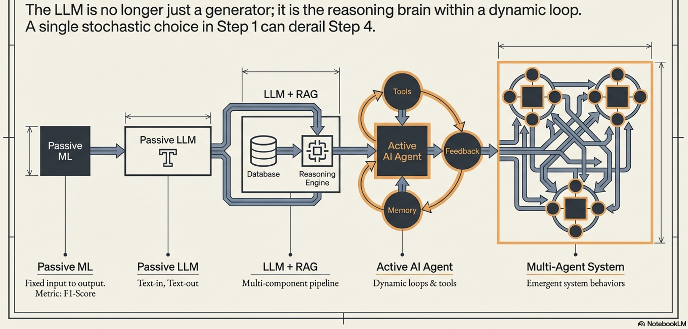

:::

### Agent Quality

Agent quality must be treated as an architectural pillar rather than a final testing phase. It is measured across a framework of four interconnected pillars:

| Pillar           | Metric Type      | Definition                                                  | Business Impact                                 |
| ---------------- | ---------------- | ----------------------------------------------------------- | ----------------------------------------------- |
| Effectiveness    | Goal Achievement | Did the agent achieve the user’s actual intent?             | Direct impact on KPIs (e.g., conversion rates). |
| Efficiency       | Operational Cost | The resource cost (tokens, time, steps) of the solution.    | Operational margins and user latency.           |
| Robustness       | Reliability      | Ability to handle API timeouts, missing data, or ambiguity. | Graceful degradation and system uptime.         |
| Safety & Alignment | Trustworthiness  | Operation within ethical boundaries and security rules.     | Risk mitigation and enterprise trust.           |

- You cannot measure Efficiency if you don't count the steps, and you cannot verify Safety if you cannot inspect the reasoning.

:::{instructor-note} Visual explanation

**Effectiveness:**
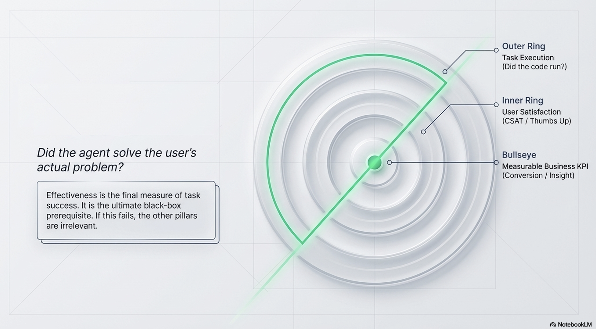

**Efficiency:**
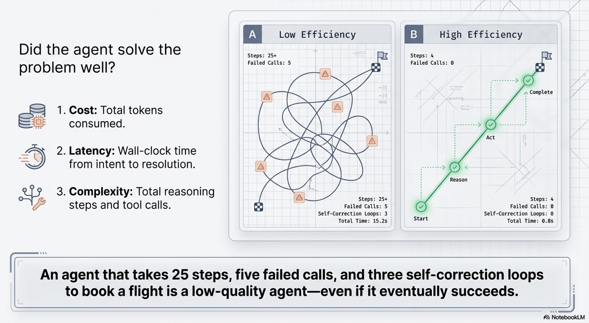

**Robustness:**
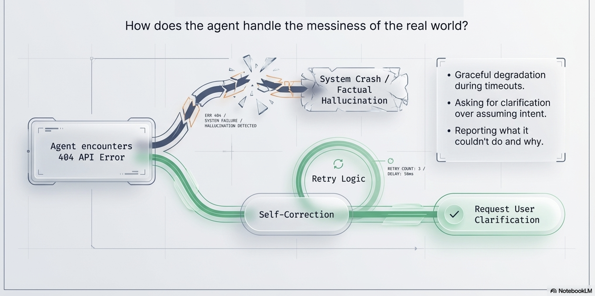

**Safety & Alignment:**
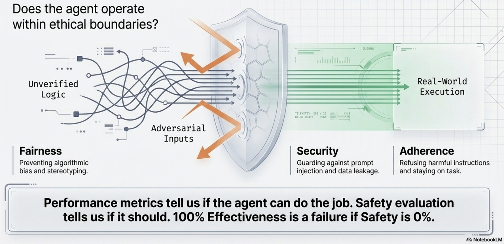

:::

### "Outside-In" evaluation strategy

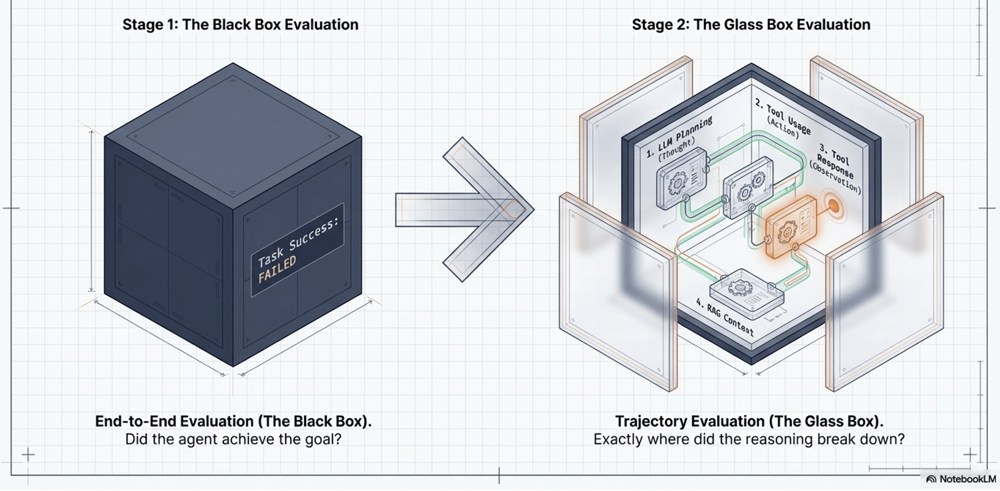

To assess these pillars, the framework uses an **"Outside-In" evaluation strategy**. It starts with the **"Black Box"** view (evaluating the final end-to-end output and user satisfaction). If there is a failure, it moves to the **"Glass Box"** view ("Inside-Out" View - evaluating the agent's internal trajectory, including its LLM planning, tool selection, and context handling) to diagnose exactly *why* it failed.

- This judgment process relies on a mix of automated metrics, scalable models evaluating other models (LLM-as-a-Judge and Agent-as-a-Judge), and indispensable Human-in-the-Loop (HITL) evaluators.

- The Black Box (End-to-End):
  - Measures Task Success Rate and User Satisfaction.
  - If the goal is met, the system is effective.
- The Glass Box (Trajectory Evaluation):
  - If the black box fails, we open the "Glass Box" to inspect the Trajectory.

    :::{note}

    - 💡 Insight: The Trajectory is the Truth. Measuring only the final answer hides fatal flaws in reasoning or tool usage.

    :::

- Glass Box Inspection Points:
  - Thought: Is the plan logical, or did Context Pollution cause a reasoning loop?
  - Tool Usage: Did the agent hallucinate tool parameters or call tools unnecessarily?
    - RAG Performance: ⚠️ Pitfall: The LLM may ignore retrieved context entirely to hallucinate a "plausible" answer.
  - Observation: Did the agent misinterpret the tool's output (e.g., ignoring a 404 error)?

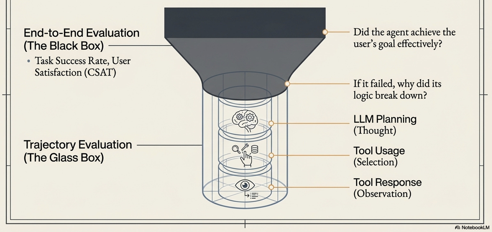

- Diagnostic Power:
  - You can't diagnose a process you can't see
  - Trace provide the visibility of the underlying process/processes
  - By analyzing the trace, we move from "the final answer is wrong" to "the answer is wrong because the agent misinterpreted the API's error response."

## Evaluator Spectrum

The "Outside-In" Evaluation Hierarchy is a top-down strategic framework that prioritizes evaluating an agent's real-world success before diving into the technical details of its execution.

The **Evaluator Spectrum** ("The Evaluators") defines the diverse set of judges required to execute this evaluation, balancing scalable automation with necessary human oversight. This spectrum includes:

- Automated Metrics:
  - Fast, reproducible metrics (like string or embedding similarity) used as a first-pass filter to catch obvious output regressions at scale.
- LLM-as-a-Judge:
  - Using a powerful language model to scalably score qualitative outputs (like helpfulness or correctness) against a defined rubric, often through pairwise comparisons.
- Agent-as-a-Judge:
  - Using a specialized agent to evaluate the *process* and full execution trace of another agent, assessing intermediate steps like plan logic and tool selection.
- Human-in-the-Loop (HITL) and User Feedback:
  - The indispensable human element needed to interpret complex nuance, apply deep domain expertise, define the "gold standard" benchmarks, and provide real-world satisfaction signals.

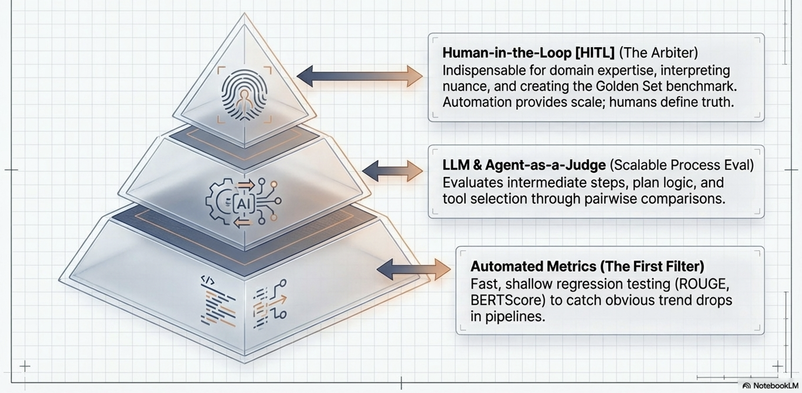

**How Evaluators Relate to "Outside-In" evaluation:**

The "Outside-In" Hierarchy dictates *what to evaluate* (final output versus internal trajectory), while the Evaluator Spectrum dictates *how* to judge it*

For example, the "Black Box" (end-to-end success) is often efficiently measured using basic **Automated Metrics** and real-world **User Feedback**. However, when a failure triggers a deeper "Glass Box" (trajectory) analysis, simple metrics fail. Evaluators must then deploy **LLM-as-a-Judge**, **Agent-as-a-Judge**, and **HITL** to accurately critique the nuanced, subjective quality of the agent's internal reasoning and intermediate steps,,.

### Agent Observability

- To evaluate a process, you must be able to see it
- Traditional software uses monitoring; agents require Observability.
- The kitchen analogy:
  - traditional software monitoring is like checking if a fast-food line cook followed a rigid, step-by-step recipe
  - Agent observability is like a food critic evaluating a gourmet chef's dynamic decisions, adaptations, and creative process

|    | Traditional Software                                        | Agentic Al                                                                         |
| ------------ | ----------------------------------------------------------- | ---------------------------------------------------------------------------------- |
| Metaphor     | The Line Cook: Follows a rigid, laminated recipe perfectly. | The Gourmet Chef: Dynamically decides le recipe based on ingredients and goals.    |
| Workflow     | Deterministic: Fixed logic and predictable paths.           | Probabilistic: Emergent behavior via Tool Use and Memory.                          |
| Failure Mode | System Crash: Explicit errors like NullPointerException.    | Quality Degradation: Silent failures like factual hallucinations or emergent bias. |
| QA Method    | Verification: Did we build the product right?               | Validation: Did we build the right product?                                        |

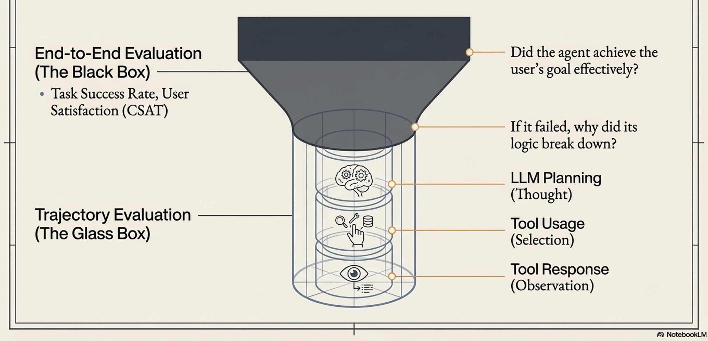

**Pillars of Observability:**

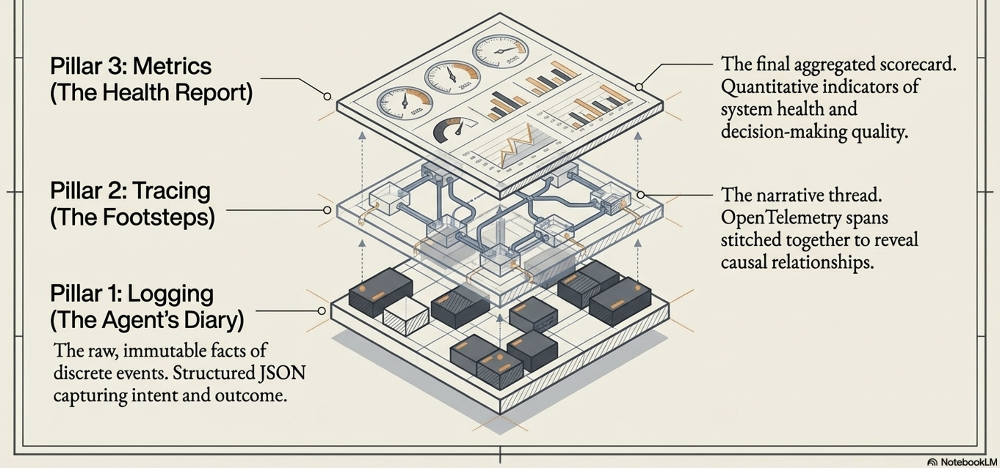

Observability provides the telemetry needed to capture an agent's "thought process" and is built on three foundational pillars:

- Logging (The Agent's Diary)
  - Structured, timestamped entries that capture raw facts about discrete events, such as the exact prompt sent to the model, the tools invoked, and the raw data received
  - Effective logging records the agent's intent before an action, and the outcome after. This separates a failed API attempt from a hallucinated decision not to act
  - 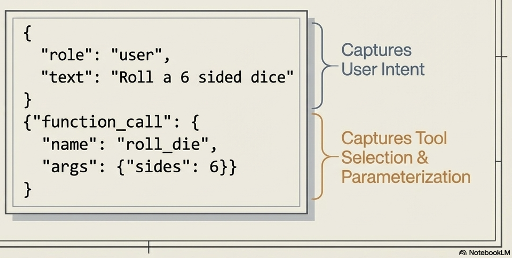
- Tracing (Following the Footsteps)
  - The narrative thread that stitches individual logs together across a single task. Traces reveal the causal relationship between events (e.g., showing that a faulty tool call caused an LLM hallucination, which led to a bad final answer).
  - 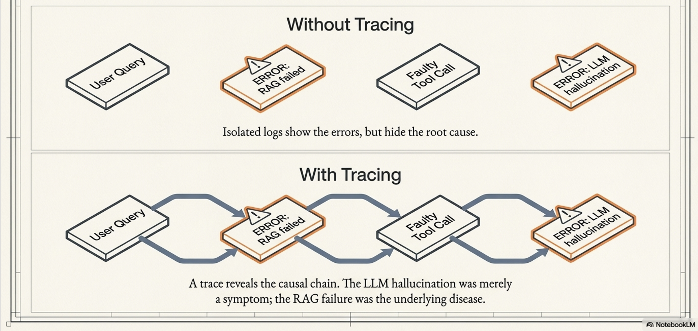
- Metrics (The Health Report):
  - The aggregated scorecard of the agent's performance over time.
  - This is divided into *System Metrics* (direct measurements like latency, error rates, and token costs) and *Quality Metrics* (evaluative scores like factual correctness, trajectory adherence, and helpfulness)
  - 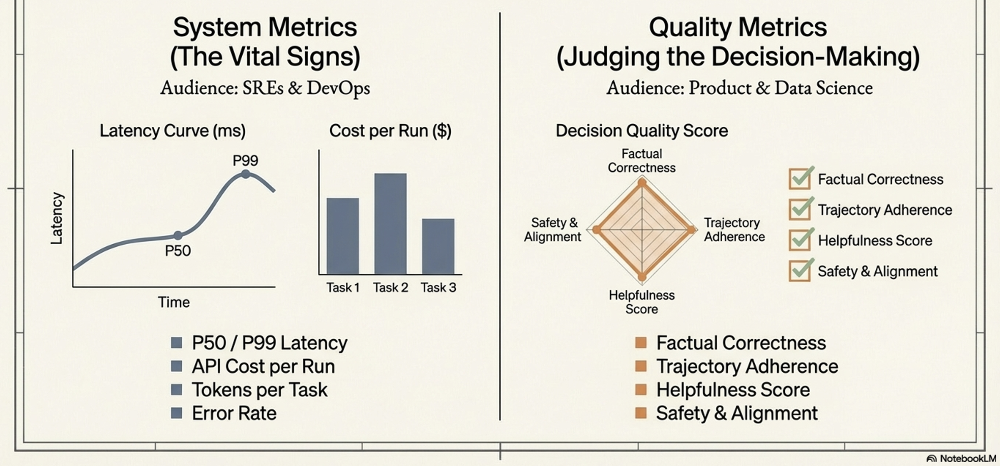

## Agent Observability & quality

Agent observability and agent quality are fundamentally interdependent, operating as a continuous loop where visibility enables judgment, and judgment drives improvement

**Observability - Prerequisite for Quality Evaluation:**

- A core principle of AI agents is that "you cannot judge a process you cannot see"
- Measuring the four pillars of agent quality (Effectiveness, Efficiency, Robustness, and Safety) is impossible if you only examine the agent's final output.
- For example,
  - you cannot measure operational efficiency without counting the number of steps an agent took,
  - you can't diagnose a robustness failure without knowing exactly which API call timed out
- A holistic framework for agent quality demands a holistic architecture for agent visibility

**The Trajectory is the Truth:**

- Execution trajectory is agent's its end-to-end "thought process".
- The true measure of an agent's logic, safety, and efficiency lies in its execution trajectory
- Observability—specifically through structured logs (the agent's diary) and end-to-end traces (the narrative thread)—provides the indispensable evidence needed to reconstruct and analyze this trajectory to understand why an agent succeeded or failed.

**Transforming Telemetry into Quality Metrics:**

- Observability supplies the raw data, while the quality evaluation framework provides the judgment
- Quality Metrics (such as factual correctness, trajectory adherence, and safety scores) are not simply raw system data; they are "second-order metrics" derived by applying a judgment layer (like an LLM-as-a-Judge or Human-in-the-Loop evaluator) directly on top of the raw logs and traces captured by observability

**Evaluatable-by-Design:**

- Architecture Because quality depends so heavily on visibility, reliable agents must be built to be "evaluatable-by-design"
- This means quality cannot be a final testing phase; instead, agents must be architected from the first line of code with the necessary "telemetry ports" to emit the observability data required for judgment

### Mapping observability to quality

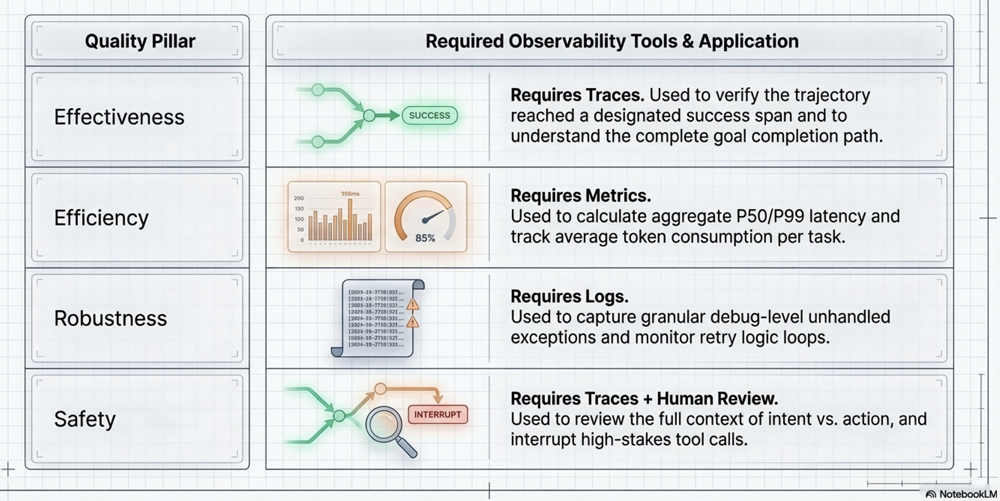

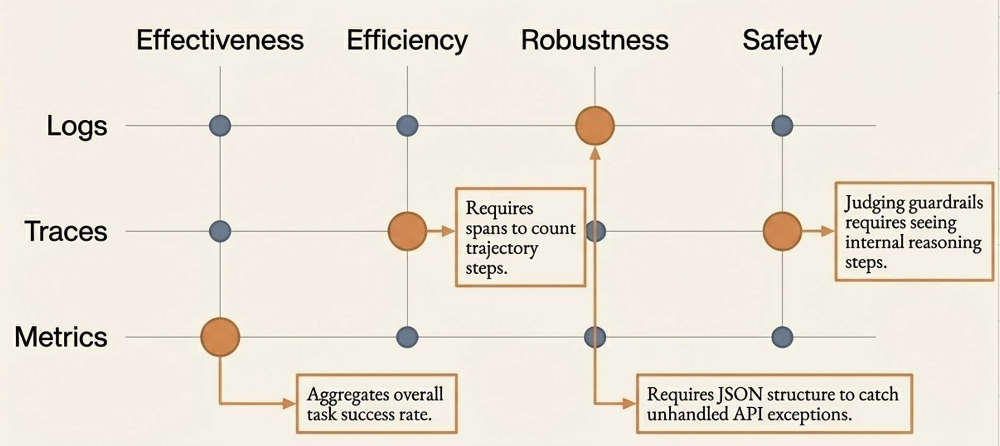

## Operationalizing data

Operationalizing data is the critical step that bridges the gap between simply collecting observability data (logs, traces, and metrics) and actually improving an AI agent's quality. While having this raw data provides the necessary components, operationalizing it means assembling these pieces into a working system that generates real-time actions and insights during live operations.

### Linking data to agent quality

**Dashboards & Alerting:**

- Separating System Health from Model Quality
- A single dashboard is insufficient for managing an AI agent.
- To effectively operationalize data, teams must separate it into two distinct views:
  - Operational Dashboards:
    - Used primarily by SREs and DevOps teams, these dashboards track real-time system metrics like P99 latency, error rates, and token consumption. They are used to trigger immediate alerts for system bottlenecks or budget overruns.
  - Quality Dashboards:
    - Used by product owners and data scientists, these dashboards track slower-moving quality metrics such as factual correctness, trajectory adherence, and helpfulness ratings. They trigger alerts for subtle degradations in the agent's logic or output quality, even when the system itself is running perfectly.

**Security & PII: Protecting Your Data:**

- Because logs and traces capture the agent's "thought process" and user interactions, they often contain Personally Identifiable Information (PII).
- Operationalizing this data safely requires implementing a robust PII scrubbing mechanism in the logging pipeline *before* the data is stored long-term, ensuring privacy and compliance.

**Managing the Trade-off: Granularity vs. Overhead:**

Capturing highly detailed observability data for every request in a production environment can cause severe latency and overhead. To operationalize data effectively, teams use **dynamic sampling**. This involves using high-granularity logging (DEBUG) in development, but switching to a lower default (INFO) in production. For example, a system might only trace 10% of successful requests to gather performance metrics, but capture 100% of all errors to preserve the rich diagnostic details needed to debug failures.

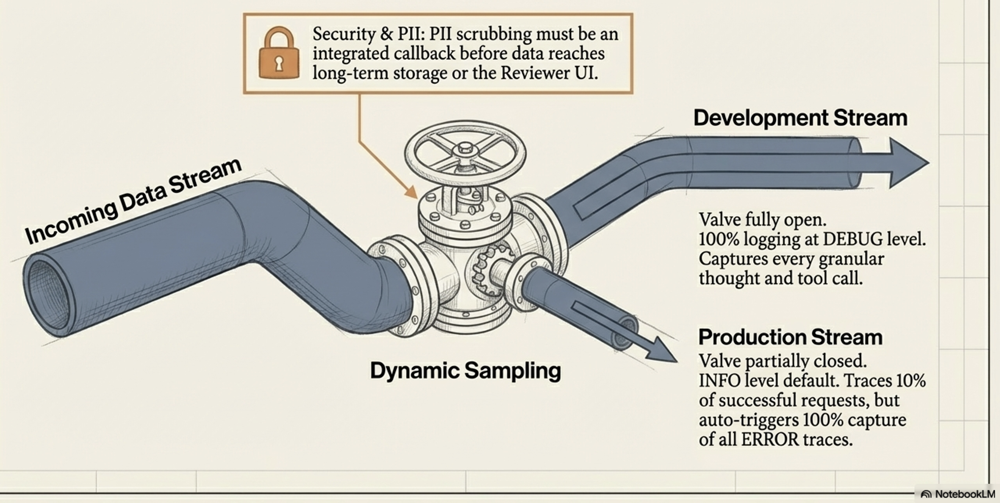

## The Agent Quality Flywheel

- The Agent Quality Flywheel is the Ultimate Goal of Operationalizing data
- **Agent Quality Flywheel:** A continuous improvement loop fed by Operationalizing data from agent system.
- Flywheel (a structured feedback loop)
  - Programmatically annotate every operational failure captured by data and
  - Convert into a permanent regression test in the system's evaluation set
- This ensures that every mistake the agent makes in production is used to make it permanently smarter, continuously driving up its overall quality.

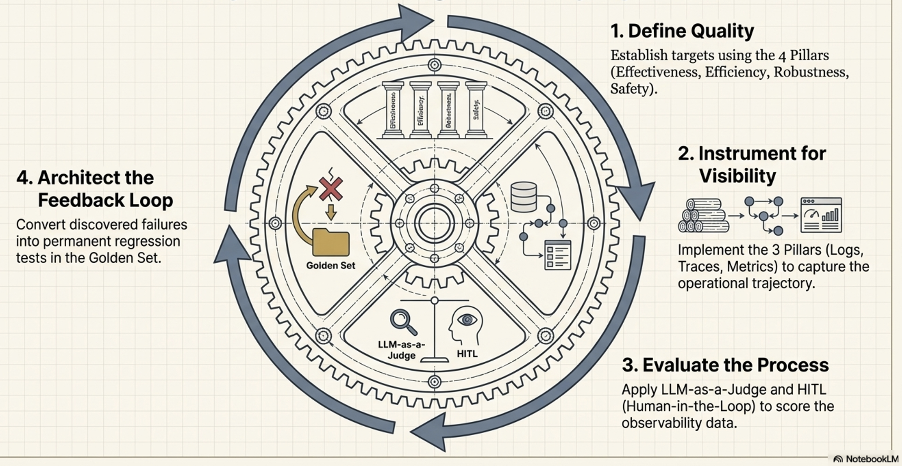

## Building Trust

**Agent quality in an non-deterministic world**
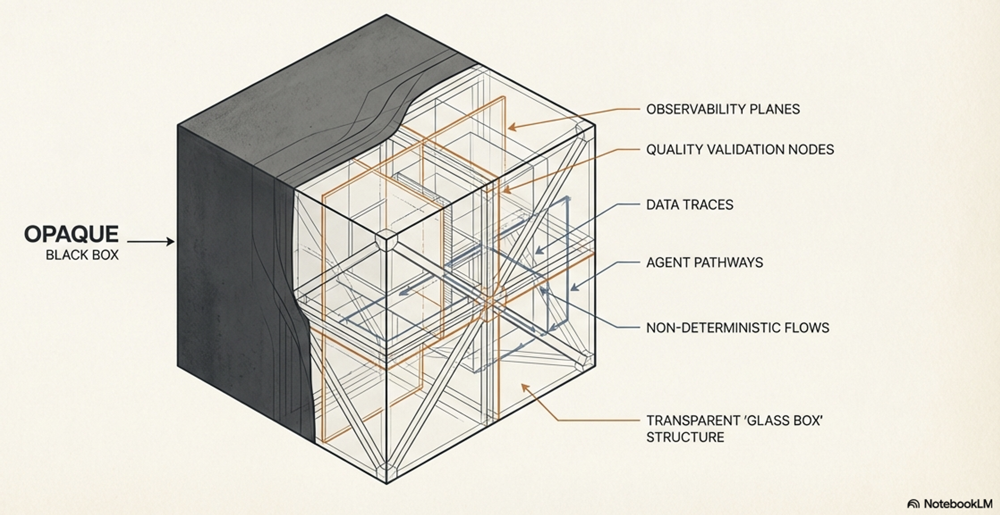

**Principals of Trustworthy agents:**
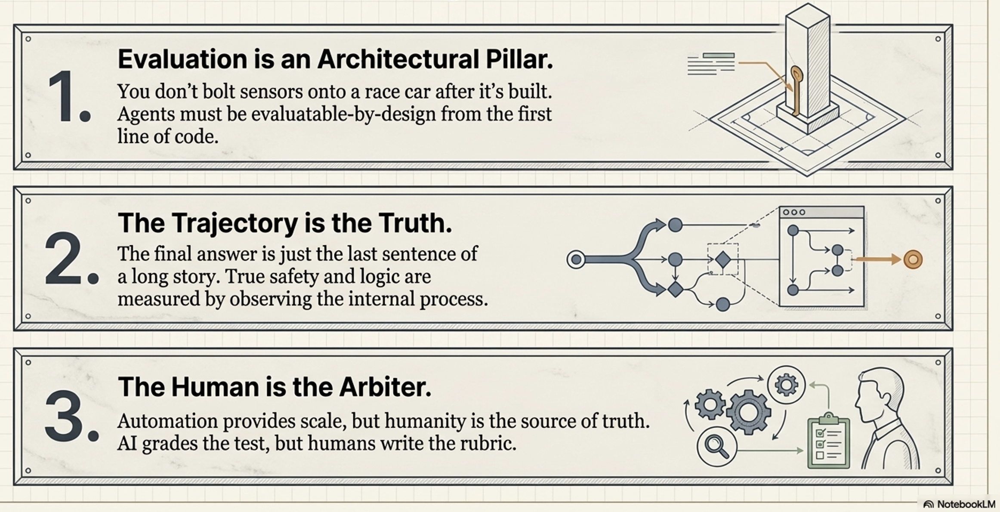
