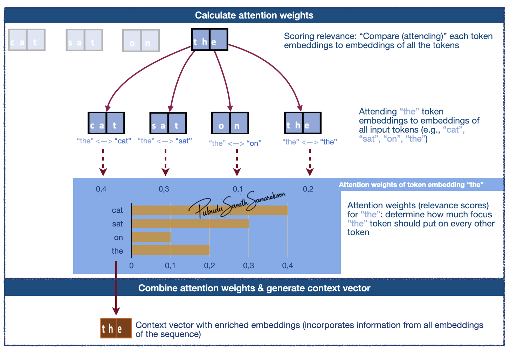
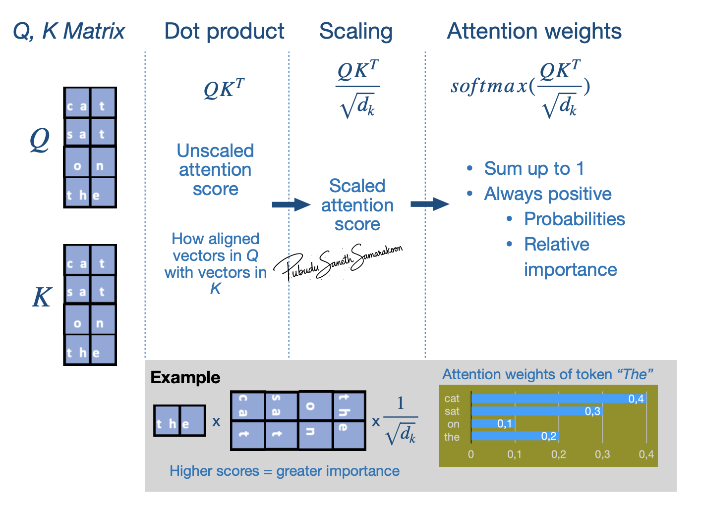

# Self-attention mechanism

:::{objectives}

- Gain a basic understanding of self-attention mechanism
- Explore how attention weights are calculated & how context vector is generated.

:::

## What is self-attention mechanism?

- Self-attention: create a new, enriched representation (context vector) by incorporating information from all token embeddings in the sequence
- Two main steps mechanism:
  1. Scoring relevance ("attending to"/"considering" all tokens) & calculate attention weights (relevance scores)
  2. Combine attention weights and generate context vector (new enriched representation)
- Context vector (context-aware representation / enriched representation):
  - Captures the specific meaning of a token embeddings within its surrounding embeddings
  - Allow the model to understand relationships and dependencies between words, regardless of how far apart they are in the sentence

## Understanding self-attention with Q, K, V weight matrix

### Overview of self-attention with Q, K, V weight matrix

:::{Note}

- Key concepts of attention mechanism
  - *Q (Query), K (Key) and V (Value)* roles input token embeddings play in attention mechanism
  - *Q, K, V projection* via *learnable projection matrices* ($W_{k}$, $W_{q}$, $W_{v}$)
  - *Attention scores* and *Attention weights*
  - *Context vectors*

:::

*Source (modified): [transformer-explainer](https://poloclub.github.io/transformer-explainer/)*

### Queries (Q), Keys (K), and Values (V)

**Three roles of input token embeddings: Queries (Q), Keys (K), and Values (V):**

- Input token embeddings play three distinct roles in the attention mechanism
- *Queries (Q)* "attend" to other vectors in the input sequence and serve as starting points to generate context vectors
- *Keys (K)* gets compared to (matched with) *Queries (Q)* when calculating attention scores (relevance scores)
- *Values (V)* serve as "reference values" that summarize scores from all-vs-all *Q* and *K* matching

**Q, K, V projection:**

- First step in attention mechanism is to project *Q, K, V embeddings* to $𝑄_{𝑚𝑎𝑡𝑟𝑖𝑥}$, $K_{𝑚𝑎𝑡𝑟𝑖𝑥}$ and $V_{𝑚𝑎𝑡𝑟𝑖𝑥}$ representations via a *learnable projection matrices*
- $𝑄_{𝑚𝑎𝑡𝑟𝑖𝑥}$: Vectors that "attend" to other vectors in the input sequence. (Actual vectors that are used as queries for the "comparison / attention")
- $𝐾_{𝑚𝑎𝑡𝑟𝑖𝑥}$: Vectors that get compared to queries
- $V_{𝑚𝑎𝑡𝑟𝑖𝑥}$: Vectors that are used to combine values from previous step and generate context vector
- $𝑄_{𝑚𝑎𝑡𝑟𝑖𝑥}$, $K_{𝑚𝑎𝑡𝑟𝑖𝑥}$ and $V_{𝑚𝑎𝑡𝑟𝑖𝑥}$ have similar dimensions to Q, K, V embeddings, but the values in these matrices can get updated during the model training (due to the *learnable projection matrices:* $W_{q}$, $W_{k}$ and $W_{v}$)

**Learnable projection matrices:** $W_{q}$, $W_{k}$ and $W_{v}$

- Without these projection matrices, the relationship between embeddings would be static
- The learnable matrices ensure that the attention mechanism is dynamic and allows $𝑄_{𝑚𝑎𝑡𝑟𝑖𝑥}$, $K_{𝑚𝑎𝑡𝑟𝑖𝑥}$ and $V_{𝑚𝑎𝑡𝑟𝑖𝑥}$ get updated in model training
- Allow the model to learn how to interpret embeddings differently depending on their context in the input sequence
  - Learnability allow the model to discover and optimize complex linguistic patterns during training

**Attention weights:**

- Attention weights are calculated by:
  1. Multiplies the Query vectors by the all the Key vectors in the sequence
  2. Scale these scores
  3. Convert scaled scores to probabilities
- These probabilities (attention weights) help model determine how much focus the current token should put on other tokens

### Context vector

- Once attention weights are calculated, the model uses them to aggregate information.
- The result is a new, enriched vectors that contain context from the relevant parts of the sequence

## Understanding attention equation (scaled Dot-Product Attention)

- Attention scores: (${QK^T}$)
- Attention weights: $softmax(\frac{QK^T}{\sqrt{d_k}})$
- Context vector calculation: $softmax(\frac{QK^T}{\sqrt{d_k}})*V$

### Attention weights calculation: $softmax(\frac{QK^T}{\sqrt{d_k}})$

**Three stage Attention weights calculation process:**

- Stages 1:  Calculate attention score with `dot product` (${QK^T}$)
- Stage 2: Scaling ($\frac{QK^T}{\sqrt{d_k}}$)
- Stage 3: Calculate "Attention weights" ($softmax(\frac{QK^T}{\sqrt{d_k}})$)

**Stages 1:  Calculate attention score with `dot product` (${QK^T}$):**

- Provides unscaled attention score (initial relevance scores) - A higher dot product means the two tokens are more aligned (similar context)
- Indicates how aligned vectors in $𝑄_{𝑚𝑎𝑡𝑟𝑖𝑥}$ with vectors in $𝐾_{𝑚𝑎𝑡𝑟𝑖𝑥}$ 
- i.e., how much focus $𝑄_{𝑚𝑎𝑡𝑟𝑖𝑥}$ vectors should put on $𝐾_{𝑚𝑎𝑡𝑟𝑖𝑥}$ vectors
- Matrix manipulation enables simultaneously compare all the vectors in $𝑄_{𝑚𝑎𝑡𝑟𝑖𝑥}$ to $𝐾_{𝑚𝑎𝑡𝑟𝑖𝑥}$

**Stage 2: Scaling ($\frac{QK^T}{\sqrt{d_k}}$):**

- Scaled attention scores
- Help avoid high-values in attention score and stabilize gradients

**Stage 3: Calculate "Attention weights" ($softmax(\frac{QK^T}{\sqrt{d_k}})$):**

- Apply `softmax` function to scaled attention scores and calculate "Attention weights"
- `softmax` function makes values to be positive and sums up 1 (convert to probabilities)
- i.e., Convert attention scores to attention weights (probabilities) what shows "relative importance" $𝑄_{𝑚𝑎𝑡𝑟𝑖𝑥}$ vectors put on $𝐾_{𝑚𝑎𝑡𝑟𝑖𝑥}$ vectors

### Main Stages: $softmax(\frac{QK^T}{\sqrt{d_k}})*V$

- Multiply these attention weights by the Value vectors ($V_{𝑚𝑎𝑡𝑟𝑖𝑥}$) and produce final context vector

- $𝑊_{𝑡ℎ𝑒}$: To what extent token "the" attend to (focus on) each input token (attention weights)
- $𝑉_{𝑚𝑎𝑡𝑟𝑖𝑥}$: Representation of input token embedding matrix

:::{instructor-note} Coding

**Coding Attention Mechanisms:**

- [Chapter 3: Coding Attention Mechanisms by by Sebastian Raschka](https://github.com/rasbt/LLMs-from-scratch/blob/main/ch03/01_main-chapter-code/ch03.ipynb)

:::