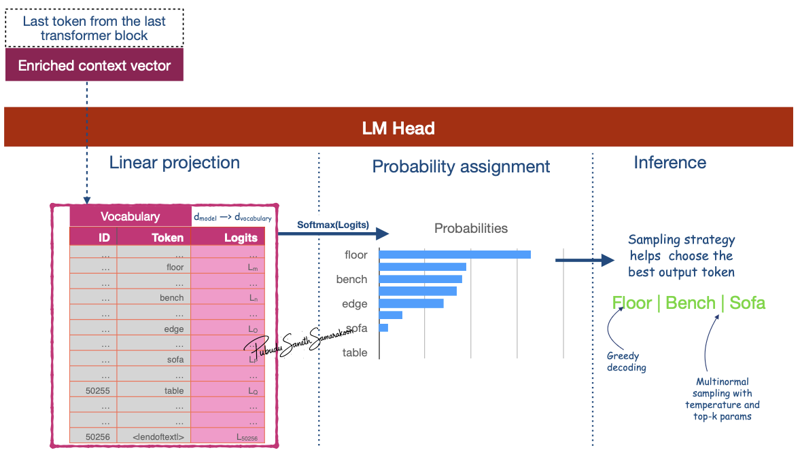

# Language Modeling Head (LM Head)

:::{objectives}

- Understand what a LM head is
- Explore how LM head help predict the next token

:::

## What is LM head?

- LM head projects the Context vector of the last token from the final block into the size of the model's vocabulary and calculates a **probability score** for every possible next token
- Enable next token prediction

## Why LM head is important?

- LM head is final component of a Transformer model, specifically in a LLM like GPT
- Connects the output of the final Transformer block to the model's vocabulary & help predict the next token

## How is the LM head help predict next token



- Input: Receives the "output vector" from the last Transformer block
  - E.g., if the model uses an embedding size of 3,072, the LM head takes in a vector of size 3,072 for each token.
- Maps this input vector to a much larger vector equal to the size of the model's vocabulary (e.g., 50,257 for GPT-2)
  - These outputs are raw, unnormalized scores called `logits`
- Convert `logits` to probability scores via softmax function
- Employ a sampling strategy to select the next token prediction

:::{instructor-note} Coding

## Custom LM-head

**Steps:**

1. Get Logits from the Language Modeling Head
2. Implement Temperature Scaling
3. Implement Top-K Sampling
4. Extract probabilities for Top-K

```python
def lm_head(model, last_token_context_vector, temperature=0.7, k=50):


    # Get Logits from the Language Modeling Head
    ## Project matrix for d_model (model dimension) to d_vocabulary (vocabulary dimensions)
    lm_head = model.get_output_embeddings()
    ## Project last_token_context_vector and extract logits 
    logits = lm_head(last_token_context_vector)

    # Implement Temperature Scaling
    # Lower temp -> more confident, less random. Higher temp -> more random, creative.
    scaled_logits = logits / temperature

    # Implement Top-K Sampling
    # We limit the sampling pool to the top 'k' most likely tokens
    top_k_logits, top_k_indices = torch.topk(scaled_logits, k)

    # Create a new tensor filled with a very low value (-inf)
    filtered_logits = torch.full_like(logits, -float("Inf"))
    # Scatter the top-k logits back into the new tensor at their original positions (Scatter the values along dimension 1)
    filtered_logits.scatter_(0, top_k_indices, top_k_logits)

    # Convert the filtered logits into a probability distribution
    probabilities = F.softmax(filtered_logits, dim=-1)
    return probabilities

```

**Steps:**

1. Decoding via multinomial sampling method to get the next token prediction

```python
## Select top-n tokens from the probabilities calculated in the LM-head

def get_top_token(probabilities, tokenizer, top_n=1):

    # Sample one token from the final probability distribution
    # torch.multinomial is used for sampling from a discrete probability distribution.
    final_token_id = torch.multinomial(probabilities, num_samples=top_n)

    # Decode the selected token ID(s) to get the final word
    final_token = tokenizer.decode(final_token_id.tolist())

    print(f"\n✅ Final Selected {top_n} Tokens: '{final_token}'")
    return final_token
```

:::{note}

- Functions `lm_head` and `get_top_token` used in [GPT-2 pre-trained end to end exercise](10_1.LLM-end-to-end.ipynb)
:::

:::
